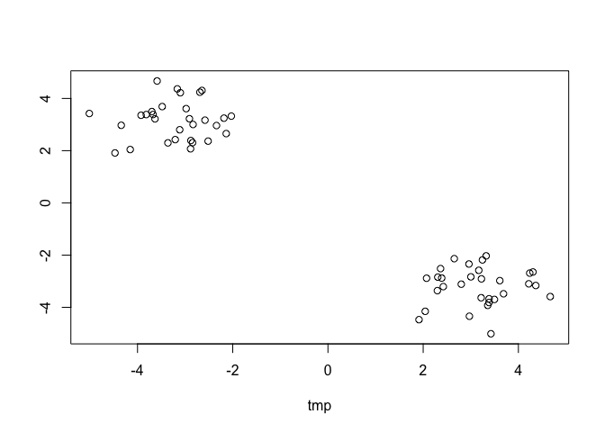
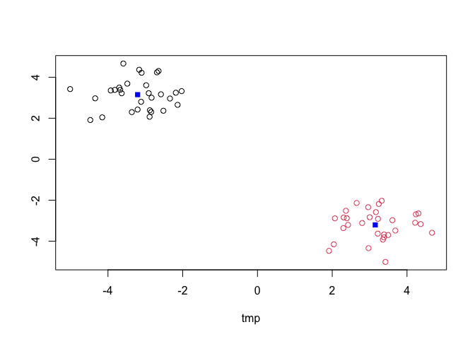
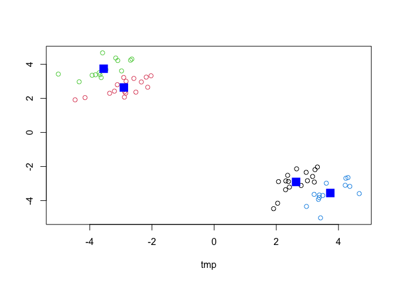
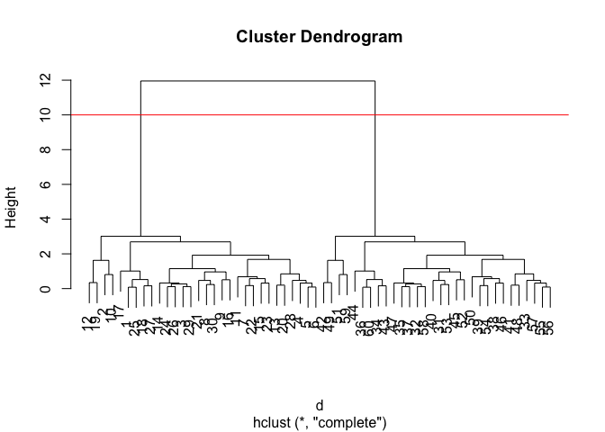
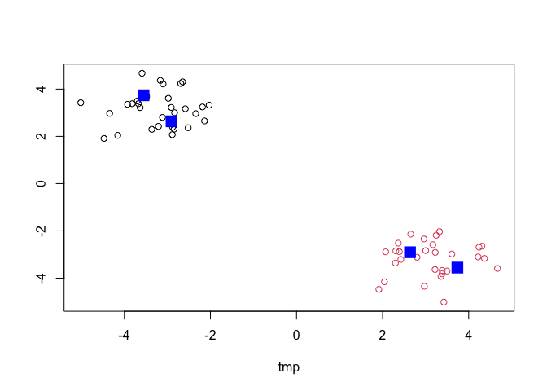
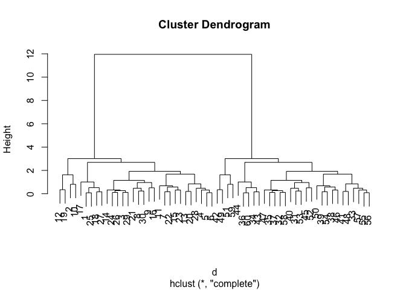
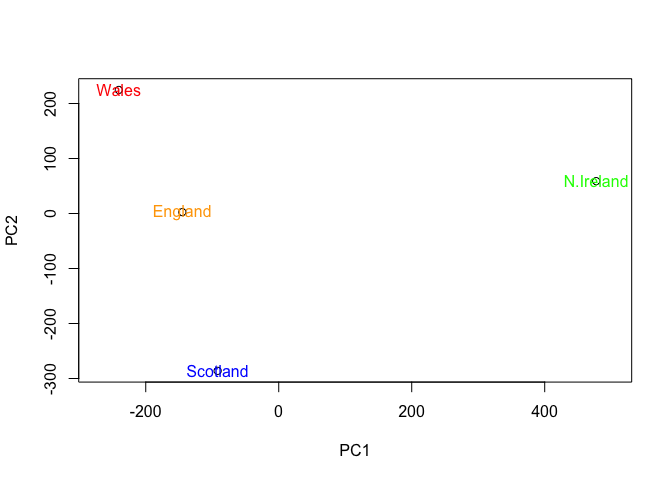
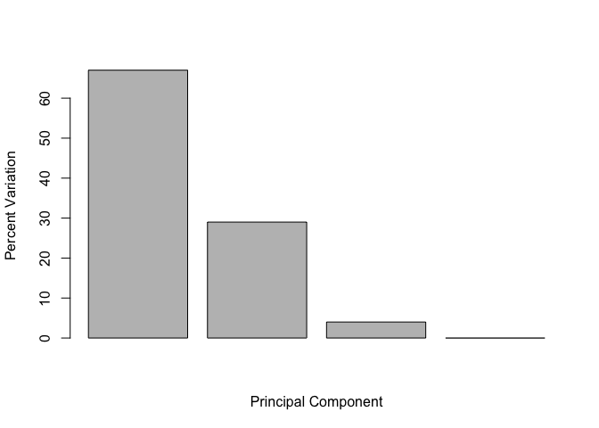

Class 7: Machine Learning I
================
Angela Liu

In this class, we will explore clustering and dimensionality reduction
methods.

## K-means

Make up some input data where we know what the answer should be.

``` r
#will make random numbers drawn from normal distribution
#rnorm(# outputs, mean, sd)
tmp <- c(rnorm(30, -3), rnorm(30, +3))

#reverse the order
#rev(tmp)

#get 2-D data: one column being tmp, the second being tmp with all the elements in the opposite order
x <- cbind(tmp, rev(tmp))
head(x)
```

               tmp         
    [1,] -2.689679 4.238206
    [2,] -4.341818 2.971093
    [3,] -3.698282 3.497058
    [4,] -2.885773 2.071243
    [5,] -2.879370 2.389123
    [6,] -2.843933 2.306650

Quick plot of x to see the two groups at -3, +3 and +3, -3

``` r
plot(x)
```



Use the `kmeans` function setting k to 2 and nstart = 20.

``` r
km <- kmeans(x, centers = 2, nstart = 20)
km
```

    K-means clustering with 2 clusters of sizes 30, 30

    Cluster means:
            tmp          
    1 -3.206695  3.150309
    2  3.150309 -3.206695

    Clustering vector:
     [1] 1 1 1 1 1 1 1 1 1 1 1 1 1 1 1 1 1 1 1 1 1 1 1 1 1 1 1 1 1 1 2 2 2 2 2 2 2 2
    [39] 2 2 2 2 2 2 2 2 2 2 2 2 2 2 2 2 2 2 2 2 2 2

    Within cluster sum of squares by cluster:
    [1] 31.11788 31.11788
     (between_SS / total_SS =  95.1 %)

    Available components:

    [1] "cluster"      "centers"      "totss"        "withinss"     "tot.withinss"
    [6] "betweenss"    "size"         "iter"         "ifault"      

``` r
#clustering vector is the cluster assignments to each element
```

Inspect/print the results

> Q: How many points are in each cluster?

``` r
km$size
```

    [1] 30 30

> Q: What component of your result object details - cluster
> assignment/membership? - cluster center?

``` r
km$cluster
```

     [1] 1 1 1 1 1 1 1 1 1 1 1 1 1 1 1 1 1 1 1 1 1 1 1 1 1 1 1 1 1 1 2 2 2 2 2 2 2 2
    [39] 2 2 2 2 2 2 2 2 2 2 2 2 2 2 2 2 2 2 2 2 2 2

``` r
km$centers
```

            tmp          
    1 -3.206695  3.150309
    2  3.150309 -3.206695

> Q: Plot x colored by the kmeans cluster assignment and add cluster
> centers as blue points

``` r
#color by cluster
plot(x, col = km$cluster)
points(km$centers, col = "blue", pch = 15)
```



``` r
c(100, 1)
```

    [1] 100   1

``` r
1:5 + c(100,1)
```

    Warning in 1:5 + c(100, 1): longer object length is not a multiple of shorter
    object length

    [1] 101   3 103   5 105

Play with kmeans and ask for different number of clusters

``` r
km <- kmeans(x, centers = 4, nstart = 20)
plot(x, col = km$cluster)
points(km$centers, col = "blue", pch = 15, cex = 2)
```



# Hierarchical Clustering

This is another very useful and widely employed clustering method which
has the advantage over kmeans in that it can help reveal something of
the true grouping in your data.

hclus(d) –\> it wants a distance; can take any distance unlike kmeans
that can only take euclidean distances

The `hclust()` function wants a distance matrix as input.

``` r
d <- dist(x)
hc <- hclust(d)
hc
```


    Call:
    hclust(d = d)

    Cluster method   : complete 
    Distance         : euclidean 
    Number of objects: 60 

There is a plot method for hclust results:

``` r
#shows two groupings
plot(hc)
#to cut the tree
abline(h=10, col = "red")
```



To get my cluster membership vector I need to “cut” my tree to yield
sub-trees or branches with all the members of a given cluster residing
on the same cut branch. The function to do this is called `cutree()`.

``` r
grps <- cutree(hc, h = 10)
grps
```

     [1] 1 1 1 1 1 1 1 1 1 1 1 1 1 1 1 1 1 1 1 1 1 1 1 1 1 1 1 1 1 1 2 2 2 2 2 2 2 2
    [39] 2 2 2 2 2 2 2 2 2 2 2 2 2 2 2 2 2 2 2 2 2 2

``` r
plot(x, col=grps)
points(km$centers, col = "blue", pch = 15, cex = 2)
```



``` r
plot(hc)
```



It is often helpful to use the `k=` argument to cutree rather than the
`h=` height of cutting with `cutree()`. This will cut the tree to yield
the number of clusters you want.

``` r
#cut to yield four clusters
cutree(hc, k=4)
```

     [1] 1 2 1 1 1 1 1 1 1 2 1 2 1 1 1 1 1 1 2 1 1 1 1 1 1 1 1 1 1 1 3 3 3 3 3 3 3 3
    [39] 3 3 3 4 3 3 3 3 3 3 4 3 4 3 3 3 3 3 3 3 4 3

# Principal Component Analysis (PCA)

The base R function for PCA is called `prcomp()`.

Importing the data:

``` r
url <- "https://tinyurl.com/UK-foods"
x <- read.csv(url)
```

> Q1. How many rows and columns are in your new data frame named x? What
> R functions could you use to answer this questions?

`dim()` function can be used to find that there are 17 rows and 5
columns.

``` r
dim(x)
```

    [1] 17  5

``` r
head(x)
```

                   X England Wales Scotland N.Ireland
    1         Cheese     105   103      103        66
    2  Carcass_meat      245   227      242       267
    3    Other_meat      685   803      750       586
    4           Fish     147   160      122        93
    5 Fats_and_oils      193   235      184       209
    6         Sugars     156   175      147       139

To make sure that the first column is not being counted in, let’s remove
it.

``` r
rownames(x) <- x[,1]
x <- x[,-1]
head(x)
```

                   England Wales Scotland N.Ireland
    Cheese             105   103      103        66
    Carcass_meat       245   227      242       267
    Other_meat         685   803      750       586
    Fish               147   160      122        93
    Fats_and_oils      193   235      184       209
    Sugars             156   175      147       139

``` r
dim(x)
```

    [1] 17  4

An alternative way to set the right row-names:

``` r
x <- read.csv(url, row.names=1)
head(x)
```

                   England Wales Scotland N.Ireland
    Cheese             105   103      103        66
    Carcass_meat       245   227      242       267
    Other_meat         685   803      750       586
    Fish               147   160      122        93
    Fats_and_oils      193   235      184       209
    Sugars             156   175      147       139

> Q2. Which approach to solving the ‘row-names problem’ mentioned above
> do you prefer and why? Is one approach more robust than another under
> certain circumstances?

The second approach is preferred and more robust because it is more
efficient and can be started at the row you want to start it at. If you
run the first approach code more than once, it will start the row more
to the right progressively.

Barplots are not very helpful:

``` r
barplot(as.matrix(x), beside=T, col=rainbow(nrow(x)))
```


> Q3: Changing what optional argument in the above barplot() function
> results in the following plot?

Changing the `beside=` argument to `FALSE` will result in a stacked bar
graph.

``` r
barplot(as.matrix(x), beside=F, col=rainbow(nrow(x)))
```


> Q5: Generating all pairwise plots may help somewhat. Can you make
> sense of the following code and resulting figure? What does it mean if
> a given point lies on the diagonal for a given plot?

The following code shows a matrix of scatterplots of each country.

``` r
pairs(x, col=rainbow(10), pch=16)
```


The plots correlate with the x-axis and y-axis. For example, the second
from top left graph shows England as the x-axis and Wale as the y-axis.
If a point lies on a diagonal, it means the data (food consumption in
this case) is similar for the two countries on the axes.

> Q6. What is the main differences between N. Ireland and the other
> countries of the UK in terms of this data-set?

The blue and orange dots are not on the diagonals with either of the
countries, so those points differ, most likely in fresh potatoes and
fresh fruit (in conjunction with the chart reference). N. Ireland has
higher food consumption in those aspects.

The `prcomp()` function operates with observations as rows, and
variables as columns.

``` r
# Use the prcomp() PCA function 
#t() trnasposes data frame matrix
pca <- prcomp( t(x) )
summary(pca)
```

    Importance of components:
                                PC1      PC2      PC3       PC4
    Standard deviation     324.1502 212.7478 73.87622 4.189e-14
    Proportion of Variance   0.6744   0.2905  0.03503 0.000e+00
    Cumulative Proportion    0.6744   0.9650  1.00000 1.000e+00

Cumulative proportion shows how much each PC captures of the total
variants.

> Q7. Complete the code below to generate a plot of PC1 vs PC2. The
> second line adds text labels over the data points.

A “PCA plot” (aka “Score plot”, PC1vsPC2 plot, etc.)

``` r
pca$x
```

                     PC1         PC2         PC3           PC4
    England   -144.99315    2.532999 -105.768945  2.842865e-14
    Wales     -240.52915  224.646925   56.475555  7.804382e-13
    Scotland   -91.86934 -286.081786   44.415495 -9.614462e-13
    N.Ireland  477.39164   58.901862    4.877895  1.448078e-13

``` r
# Plot PC1 vs PC2
plot(pca$x[,1], pca$x[,2], xlab="PC1", ylab="PC2", xlim=c(-270,500))
text(pca$x[,1], pca$x[,2], colnames(x))
```


> Q8. Customize your plot so that the colors of the country names match
> the colors in our UK and Ireland map and table at start of this
> document.

``` r
plot(pca$x[,1], pca$x[,2], xlab="PC1", ylab="PC2", xlim=c(-270,500))
text(pca$x[,1], pca$x[,2], colnames(x), col = c("orange", "red", "blue", "green"))
```



``` r
v <- round( pca$sdev^2/sum(pca$sdev^2) * 100 )
v
```

    [1] 67 29  4  0

``` r
z <- summary(pca)
z$importance
```

                                 PC1       PC2      PC3          PC4
    Standard deviation     324.15019 212.74780 73.87622 4.188568e-14
    Proportion of Variance   0.67444   0.29052  0.03503 0.000000e+00
    Cumulative Proportion    0.67444   0.96497  1.00000 1.000000e+00

To summarize in a plot of variances w/respect to the PC number:

``` r
barplot(v, xlab="Principal Component", ylab="Percent Variation")
```



## Loading Scores

``` r
## Lets focus on PC1 as it accounts for > 90% of variance 
par(mar=c(10, 3, 0.35, 0))
barplot( pca$rotation[,1], las=2 )
```


The positive bars show that Ireland eat more fresh potatoes and soft
drinks, while the negative bars reveal that the other countries eat a
lot more fresh fruit and drink more alcoholic drinks.
