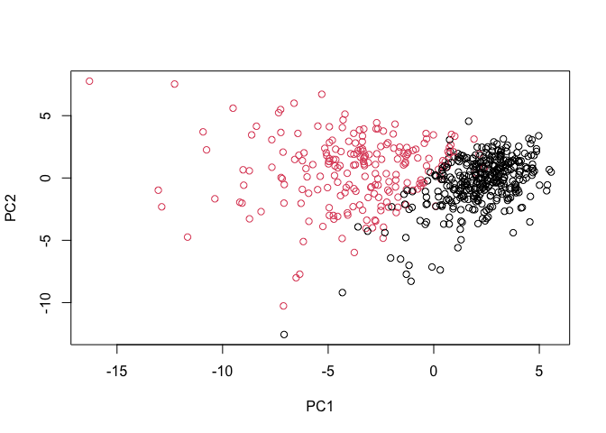
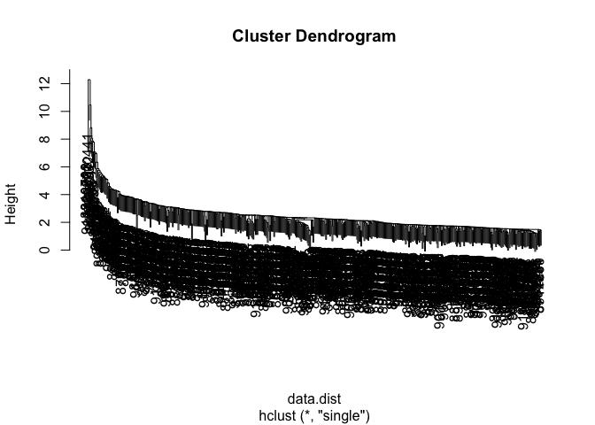
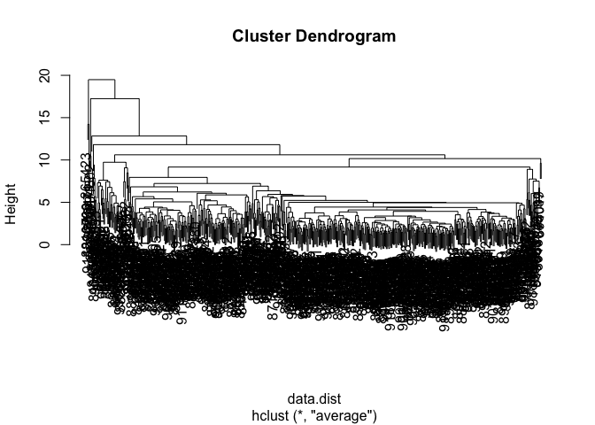
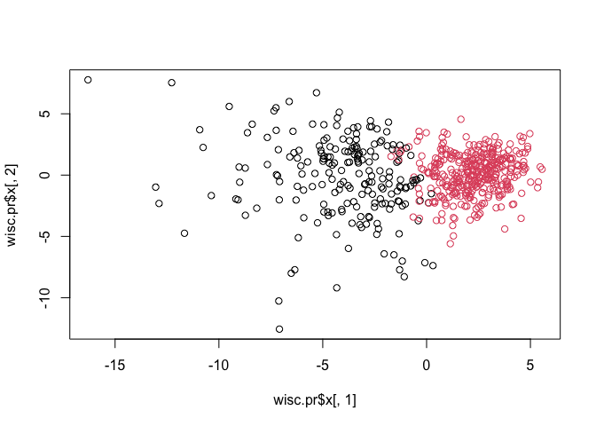

Class 08 Mini Project
================
Angela Liu

In today’s mini-project we will explore a complete analysis using
unsupervised learning techniques – clustering and PCA.

The data itself comes from the Wisconsin Breast Cancer Diagnostic Data
Set FNA breast biopsy data

## Data Import

``` r
# Save your input data file into your Project directory
fna.data <- "WisconsinCancer.csv"

# Complete the following code to input the data and store as wisc.df
wisc.df <- read.csv(fna.data, row.names=1)
```

Remove the first column:

``` r
# We can use -1 here to remove the first column
wisc.data <- wisc.df[,-1]
head(wisc.data)
```

             radius_mean texture_mean perimeter_mean area_mean smoothness_mean
    842302         17.99        10.38         122.80    1001.0         0.11840
    842517         20.57        17.77         132.90    1326.0         0.08474
    84300903       19.69        21.25         130.00    1203.0         0.10960
    84348301       11.42        20.38          77.58     386.1         0.14250
    84358402       20.29        14.34         135.10    1297.0         0.10030
    843786         12.45        15.70          82.57     477.1         0.12780
             compactness_mean concavity_mean concave.points_mean symmetry_mean
    842302            0.27760         0.3001             0.14710        0.2419
    842517            0.07864         0.0869             0.07017        0.1812
    84300903          0.15990         0.1974             0.12790        0.2069
    84348301          0.28390         0.2414             0.10520        0.2597
    84358402          0.13280         0.1980             0.10430        0.1809
    843786            0.17000         0.1578             0.08089        0.2087
             fractal_dimension_mean radius_se texture_se perimeter_se area_se
    842302                  0.07871    1.0950     0.9053        8.589  153.40
    842517                  0.05667    0.5435     0.7339        3.398   74.08
    84300903                0.05999    0.7456     0.7869        4.585   94.03
    84348301                0.09744    0.4956     1.1560        3.445   27.23
    84358402                0.05883    0.7572     0.7813        5.438   94.44
    843786                  0.07613    0.3345     0.8902        2.217   27.19
             smoothness_se compactness_se concavity_se concave.points_se
    842302        0.006399        0.04904      0.05373           0.01587
    842517        0.005225        0.01308      0.01860           0.01340
    84300903      0.006150        0.04006      0.03832           0.02058
    84348301      0.009110        0.07458      0.05661           0.01867
    84358402      0.011490        0.02461      0.05688           0.01885
    843786        0.007510        0.03345      0.03672           0.01137
             symmetry_se fractal_dimension_se radius_worst texture_worst
    842302       0.03003             0.006193        25.38         17.33
    842517       0.01389             0.003532        24.99         23.41
    84300903     0.02250             0.004571        23.57         25.53
    84348301     0.05963             0.009208        14.91         26.50
    84358402     0.01756             0.005115        22.54         16.67
    843786       0.02165             0.005082        15.47         23.75
             perimeter_worst area_worst smoothness_worst compactness_worst
    842302            184.60     2019.0           0.1622            0.6656
    842517            158.80     1956.0           0.1238            0.1866
    84300903          152.50     1709.0           0.1444            0.4245
    84348301           98.87      567.7           0.2098            0.8663
    84358402          152.20     1575.0           0.1374            0.2050
    843786            103.40      741.6           0.1791            0.5249
             concavity_worst concave.points_worst symmetry_worst
    842302            0.7119               0.2654         0.4601
    842517            0.2416               0.1860         0.2750
    84300903          0.4504               0.2430         0.3613
    84348301          0.6869               0.2575         0.6638
    84358402          0.4000               0.1625         0.2364
    843786            0.5355               0.1741         0.3985
             fractal_dimension_worst
    842302                   0.11890
    842517                   0.08902
    84300903                 0.08758
    84348301                 0.17300
    84358402                 0.07678
    843786                   0.12440

Creating a vector `diagnosis` that has the diagnosis data.

``` r
# Create diagnosis vector for later 
diagnosis <- wisc.df$diagnosis
diagnosis
```

      [1] "M" "M" "M" "M" "M" "M" "M" "M" "M" "M" "M" "M" "M" "M" "M" "M" "M" "M"
     [19] "M" "B" "B" "B" "M" "M" "M" "M" "M" "M" "M" "M" "M" "M" "M" "M" "M" "M"
     [37] "M" "B" "M" "M" "M" "M" "M" "M" "M" "M" "B" "M" "B" "B" "B" "B" "B" "M"
     [55] "M" "B" "M" "M" "B" "B" "B" "B" "M" "B" "M" "M" "B" "B" "B" "B" "M" "B"
     [73] "M" "M" "B" "M" "B" "M" "M" "B" "B" "B" "M" "M" "B" "M" "M" "M" "B" "B"
     [91] "B" "M" "B" "B" "M" "M" "B" "B" "B" "M" "M" "B" "B" "B" "B" "M" "B" "B"
    [109] "M" "B" "B" "B" "B" "B" "B" "B" "B" "M" "M" "M" "B" "M" "M" "B" "B" "B"
    [127] "M" "M" "B" "M" "B" "M" "M" "B" "M" "M" "B" "B" "M" "B" "B" "M" "B" "B"
    [145] "B" "B" "M" "B" "B" "B" "B" "B" "B" "B" "B" "B" "M" "B" "B" "B" "B" "M"
    [163] "M" "B" "M" "B" "B" "M" "M" "B" "B" "M" "M" "B" "B" "B" "B" "M" "B" "B"
    [181] "M" "M" "M" "B" "M" "B" "M" "B" "B" "B" "M" "B" "B" "M" "M" "B" "M" "M"
    [199] "M" "M" "B" "M" "M" "M" "B" "M" "B" "M" "B" "B" "M" "B" "M" "M" "M" "M"
    [217] "B" "B" "M" "M" "B" "B" "B" "M" "B" "B" "B" "B" "B" "M" "M" "B" "B" "M"
    [235] "B" "B" "M" "M" "B" "M" "B" "B" "B" "B" "M" "B" "B" "B" "B" "B" "M" "B"
    [253] "M" "M" "M" "M" "M" "M" "M" "M" "M" "M" "M" "M" "M" "M" "B" "B" "B" "B"
    [271] "B" "B" "M" "B" "M" "B" "B" "M" "B" "B" "M" "B" "M" "M" "B" "B" "B" "B"
    [289] "B" "B" "B" "B" "B" "B" "B" "B" "B" "M" "B" "B" "M" "B" "M" "B" "B" "B"
    [307] "B" "B" "B" "B" "B" "B" "B" "B" "B" "B" "B" "M" "B" "B" "B" "M" "B" "M"
    [325] "B" "B" "B" "B" "M" "M" "M" "B" "B" "B" "B" "M" "B" "M" "B" "M" "B" "B"
    [343] "B" "M" "B" "B" "B" "B" "B" "B" "B" "M" "M" "M" "B" "B" "B" "B" "B" "B"
    [361] "B" "B" "B" "B" "B" "M" "M" "B" "M" "M" "M" "B" "M" "M" "B" "B" "B" "B"
    [379] "B" "M" "B" "B" "B" "B" "B" "M" "B" "B" "B" "M" "B" "B" "M" "M" "B" "B"
    [397] "B" "B" "B" "B" "M" "B" "B" "B" "B" "B" "B" "B" "M" "B" "B" "B" "B" "B"
    [415] "M" "B" "B" "M" "B" "B" "B" "B" "B" "B" "B" "B" "B" "B" "B" "B" "M" "B"
    [433] "M" "M" "B" "M" "B" "B" "B" "B" "B" "M" "B" "B" "M" "B" "M" "B" "B" "M"
    [451] "B" "M" "B" "B" "B" "B" "B" "B" "B" "B" "M" "M" "B" "B" "B" "B" "B" "B"
    [469] "M" "B" "B" "B" "B" "B" "B" "B" "B" "B" "B" "M" "B" "B" "B" "B" "B" "B"
    [487] "B" "M" "B" "M" "B" "B" "M" "B" "B" "B" "B" "B" "M" "M" "B" "M" "B" "M"
    [505] "B" "B" "B" "B" "B" "M" "B" "B" "M" "B" "M" "B" "M" "M" "B" "B" "B" "M"
    [523] "B" "B" "B" "B" "B" "B" "B" "B" "B" "B" "B" "M" "B" "M" "M" "B" "B" "B"
    [541] "B" "B" "B" "B" "B" "B" "B" "B" "B" "B" "B" "B" "B" "B" "B" "B" "B" "B"
    [559] "B" "B" "B" "B" "M" "M" "M" "M" "M" "M" "B"

> Q1. How many observations are in this dataset?

There are 569 observations/patients in the data set.

``` r
nrow(wisc.data)
```

    [1] 569

> Q2. How many of the observations have a malignant diagnosis?

There are 212 observations with a malignant diagnosis. This was found by
using `grep()` function to see which elements in `diagnosis` vector have
malignant (“M”) diagnosis.

``` r
#grep to look for matches with malignant diagnoses and length to see how many matches in the entire vector
length(grep("M", diagnosis))
```

    [1] 212

``` r
#or can use table() function to count up the malignant diagnoses
table(diagnosis)
```

    diagnosis
      B   M 
    357 212 

> Q3. How many variables/features in the data are suffixed with \_mean?

Let’s look at the column names first:

``` r
colnames(wisc.data)
```

     [1] "radius_mean"             "texture_mean"           
     [3] "perimeter_mean"          "area_mean"              
     [5] "smoothness_mean"         "compactness_mean"       
     [7] "concavity_mean"          "concave.points_mean"    
     [9] "symmetry_mean"           "fractal_dimension_mean" 
    [11] "radius_se"               "texture_se"             
    [13] "perimeter_se"            "area_se"                
    [15] "smoothness_se"           "compactness_se"         
    [17] "concavity_se"            "concave.points_se"      
    [19] "symmetry_se"             "fractal_dimension_se"   
    [21] "radius_worst"            "texture_worst"          
    [23] "perimeter_worst"         "area_worst"             
    [25] "smoothness_worst"        "compactness_worst"      
    [27] "concavity_worst"         "concave.points_worst"   
    [29] "symmetry_worst"          "fractal_dimension_worst"

The `grep()` function helps us to look for the column names containing
“\_mean”. The `length()` function will show the results of the vector.

``` r
#look through column names to find ones with "mean" with the grep function
#use length to find the number of column names with the key word
matches <- (grep("_mean", colnames(wisc.data)))
length(matches)
```

    [1] 10

There are 10 variables/features suffixed with \_mean.

> Q. How many dimensions are in this dataset?

``` r
ncol(wisc.data)
```

    [1] 30

## Principal Component Analysis (PCA)

Let’s check the mean and standard deviation:

``` r
# Check column means and standard deviations
colMeans(wisc.data)
```

                radius_mean            texture_mean          perimeter_mean 
               1.412729e+01            1.928965e+01            9.196903e+01 
                  area_mean         smoothness_mean        compactness_mean 
               6.548891e+02            9.636028e-02            1.043410e-01 
             concavity_mean     concave.points_mean           symmetry_mean 
               8.879932e-02            4.891915e-02            1.811619e-01 
     fractal_dimension_mean               radius_se              texture_se 
               6.279761e-02            4.051721e-01            1.216853e+00 
               perimeter_se                 area_se           smoothness_se 
               2.866059e+00            4.033708e+01            7.040979e-03 
             compactness_se            concavity_se       concave.points_se 
               2.547814e-02            3.189372e-02            1.179614e-02 
                symmetry_se    fractal_dimension_se            radius_worst 
               2.054230e-02            3.794904e-03            1.626919e+01 
              texture_worst         perimeter_worst              area_worst 
               2.567722e+01            1.072612e+02            8.805831e+02 
           smoothness_worst       compactness_worst         concavity_worst 
               1.323686e-01            2.542650e-01            2.721885e-01 
       concave.points_worst          symmetry_worst fractal_dimension_worst 
               1.146062e-01            2.900756e-01            8.394582e-02 

``` r
round(apply(wisc.data,2,sd))
```

                radius_mean            texture_mean          perimeter_mean 
                          4                       4                      24 
                  area_mean         smoothness_mean        compactness_mean 
                        352                       0                       0 
             concavity_mean     concave.points_mean           symmetry_mean 
                          0                       0                       0 
     fractal_dimension_mean               radius_se              texture_se 
                          0                       0                       1 
               perimeter_se                 area_se           smoothness_se 
                          2                      45                       0 
             compactness_se            concavity_se       concave.points_se 
                          0                       0                       0 
                symmetry_se    fractal_dimension_se            radius_worst 
                          0                       0                       5 
              texture_worst         perimeter_worst              area_worst 
                          6                      34                     569 
           smoothness_worst       compactness_worst         concavity_worst 
                          0                       0                       0 
       concave.points_worst          symmetry_worst fractal_dimension_worst 
                          0                       0                       0 

The data above is not standardized at all. First we need to scale the
data with `prcomp()`.

``` r
# Perform PCA on wisc.data by completing the following code
wisc.pr <- prcomp(wisc.data, scale = TRUE)
summary(wisc.pr)
```

    Importance of components:
                              PC1    PC2     PC3     PC4     PC5     PC6     PC7
    Standard deviation     3.6444 2.3857 1.67867 1.40735 1.28403 1.09880 0.82172
    Proportion of Variance 0.4427 0.1897 0.09393 0.06602 0.05496 0.04025 0.02251
    Cumulative Proportion  0.4427 0.6324 0.72636 0.79239 0.84734 0.88759 0.91010
                               PC8    PC9    PC10   PC11    PC12    PC13    PC14
    Standard deviation     0.69037 0.6457 0.59219 0.5421 0.51104 0.49128 0.39624
    Proportion of Variance 0.01589 0.0139 0.01169 0.0098 0.00871 0.00805 0.00523
    Cumulative Proportion  0.92598 0.9399 0.95157 0.9614 0.97007 0.97812 0.98335
                              PC15    PC16    PC17    PC18    PC19    PC20   PC21
    Standard deviation     0.30681 0.28260 0.24372 0.22939 0.22244 0.17652 0.1731
    Proportion of Variance 0.00314 0.00266 0.00198 0.00175 0.00165 0.00104 0.0010
    Cumulative Proportion  0.98649 0.98915 0.99113 0.99288 0.99453 0.99557 0.9966
                              PC22    PC23   PC24    PC25    PC26    PC27    PC28
    Standard deviation     0.16565 0.15602 0.1344 0.12442 0.09043 0.08307 0.03987
    Proportion of Variance 0.00091 0.00081 0.0006 0.00052 0.00027 0.00023 0.00005
    Cumulative Proportion  0.99749 0.99830 0.9989 0.99942 0.99969 0.99992 0.99997
                              PC29    PC30
    Standard deviation     0.02736 0.01153
    Proportion of Variance 0.00002 0.00000
    Cumulative Proportion  1.00000 1.00000

> Q4. From your results, what proportion of the original variance is
> captured by the first principal components (PC1)?

PC1 covers 44.27% of the original variance of the whole data set. This
makes sense because PC1 covers the most and the subsequent PCs start
covering less.

> Q5. How many principal components (PCs) are required to describe at
> least 70% of the original variance in the data?

We look at the cumulative proportion of the components, and see that
three PCs are needed to describe at least 70% of the original variance.
Three of them show 72.6% of the original variance.

> Q6. How many principal components (PCs) are required to describe at
> least 90% of the original variance in the data?

Seven PCs describe at least 90% of the original variance.

> Q7. What stands out to you about this plot? Is it easy or difficult to
> understand? Why?

``` r
biplot(wisc.pr)
```


This plot is very cluttered and hard to understand. It uses rownames as
plotting characters and makes it hard to distinguish any trend with the
eye.

Let’s make a standard scatter plot of PC1 vs PC2.

``` r
#splitting/factoring the diagnosis into groups
diagnosis <- factor(wisc.df$diagnosis)

# Scatter plot observations by components 1 and 2
plot(wisc.pr$x[,1], wisc.pr$x[,2], col = diagnosis, 
     xlab = "PC1", ylab = "PC2")
```



> Q8. Generate a similar plot for principal components 1 and 3. What do
> you notice about these plots?

``` r
# Repeat for components 1 and 3
plot(wisc.pr$x[,1], wisc.pr$x[,3], col = diagnosis, 
     xlab = "PC1", ylab = "PC3")
```


The separation between the two groups are less distinct than PC1 vs PC2
since they have better proportion of original variance than PC3.

Use `ggplot` to make a better visualization plot.

``` r
# Create a data.frame for ggplot
df <- as.data.frame(wisc.pr$x)
df$diagnosis <- diagnosis

# Load the ggplot2 package
library(ggplot2)

# Make a scatter plot colored by diagnosis
ggplot(df) + 
  aes(PC1, PC2, col=df$diagnosis) + 
  geom_point()
```


## Scree Plots

Scree plots are used to show the proportion of variance. They have
‘elbows’ where you can figure out number of principal components by eye
more naturally.

We will begin by calculating te variance of each principal component. To
do this, we sequare the sdev of `wisc.pr`

``` r
# Calculate variance of each component
pr.var <- wisc.pr$sdev^2
head(pr.var)
```

    [1] 13.281608  5.691355  2.817949  1.980640  1.648731  1.207357

Now we will calculate the variance given by each principal component. We
will divide the variance from each PC by the total variance.

``` r
# Variance explained by each principal component: pve
pve <- pr.var/ sum(pr.var)

# Plot variance explained for each principal component
plot(pve, xlab = "Principal Component", 
     ylab = "Proportion of Variance Explained", 
     ylim = c(0, 1), type = "o")
```


``` r
# Alternative scree plot of the same data, note data driven y-axis
barplot(pve, ylab = "Precent of Variance Explained",
     names.arg=paste0("PC",1:length(pve)), las=2, axes = FALSE)
axis(2, at=pve, labels=round(pve,2)*100 )
```


> Q9. For the first principal component, what is the component of the
> loading vector (i.e. wisc.pr\$rotation\[,1\]) for the feature
> concave.points_mean?

How much do the original variables contribute to the new PCs that we
have calculated? We can see this through `$rotation`.

``` r
head(wisc.pr$rotation)
```

                            PC1         PC2          PC3         PC4         PC5
    radius_mean      -0.2189024  0.23385713 -0.008531243  0.04140896 -0.03778635
    texture_mean     -0.1037246  0.05970609  0.064549903 -0.60305000  0.04946885
    perimeter_mean   -0.2275373  0.21518136 -0.009314220  0.04198310 -0.03737466
    area_mean        -0.2209950  0.23107671  0.028699526  0.05343380 -0.01033125
    smoothness_mean  -0.1425897 -0.18611302 -0.104291904  0.15938277  0.36508853
    compactness_mean -0.2392854 -0.15189161 -0.074091571  0.03179458 -0.01170397
                              PC6         PC7          PC8          PC9        PC10
    radius_mean       0.018740790 -0.12408834  0.007452296 -0.223109764  0.09548644
    texture_mean     -0.032178837  0.01139954 -0.130674825  0.112699390  0.24093407
    perimeter_mean    0.017308445 -0.11447706  0.018687258 -0.223739213  0.08638562
    area_mean        -0.001887748 -0.05165343 -0.034673604 -0.195586014  0.07495649
    smoothness_mean  -0.286374497 -0.14066899  0.288974575  0.006424722 -0.06929268
    compactness_mean -0.014130949  0.03091850  0.151396350 -0.167841425  0.01293620
                            PC11        PC12       PC13         PC14        PC15
    radius_mean      -0.04147149  0.05106746 0.01196721  0.059506135 -0.05111877
    texture_mean      0.30224340  0.25489642 0.20346133 -0.021560100 -0.10792242
    perimeter_mean   -0.01678264  0.03892611 0.04410950  0.048513812 -0.03990294
    area_mean        -0.11016964  0.06543751 0.06737574  0.010830829  0.01396691
    smoothness_mean   0.13702184  0.31672721 0.04557360  0.445064860 -0.11814336
    compactness_mean  0.30800963 -0.10401704 0.22928130  0.008101057  0.23089996
                           PC16        PC17         PC18        PC19        PC20
    radius_mean      -0.1505839  0.20292425  0.146712338  0.22538466 -0.04969866
    texture_mean     -0.1578420 -0.03870612 -0.041102985  0.02978864 -0.24413499
    perimeter_mean   -0.1144540  0.19482131  0.158317455  0.23959528 -0.01766501
    area_mean        -0.1324480  0.25570576  0.266168105 -0.02732219 -0.09014376
    smoothness_mean  -0.2046132  0.16792991 -0.352226802 -0.16456584  0.01710096
    compactness_mean  0.1701784 -0.02030771  0.007794138  0.28422236  0.48868633
                            PC21        PC22          PC23        PC24        PC25
    radius_mean      -0.06857001 -0.07292890 -0.0985526942 -0.18257944 -0.01922650
    texture_mean      0.44836947 -0.09480063 -0.0005549975  0.09878679  0.08474593
    perimeter_mean   -0.06976904 -0.07516048 -0.0402447050 -0.11664888  0.02701541
    area_mean        -0.01844328 -0.09756578  0.0077772734  0.06984834 -0.21004078
    smoothness_mean  -0.11949175 -0.06382295 -0.0206657211  0.06869742  0.02895489
    compactness_mean  0.19262140  0.09807756  0.0523603957 -0.10413552  0.39662323
                            PC26        PC27          PC28         PC29
    radius_mean      -0.12947640 -0.13152667  2.111940e-01  0.211460455
    texture_mean     -0.02455666 -0.01735731 -6.581146e-05 -0.010533934
    perimeter_mean   -0.12525595 -0.11541542  8.433827e-02  0.383826098
    area_mean         0.36272740  0.46661248 -2.725083e-01 -0.422794920
    smoothness_mean  -0.03700369  0.06968992  1.479269e-03 -0.003434667
    compactness_mean  0.26280847  0.09774871 -5.462767e-03 -0.041016774
                             PC30
    radius_mean       0.702414091
    texture_mean      0.000273661
    perimeter_mean   -0.689896968
    area_mean        -0.032947348
    smoothness_mean  -0.004847458
    compactness_mean  0.044674186

``` r
wisc.pr$rotation["concave.points_mean", 1]
```

    [1] -0.2608538

The component of the loading vector for `concave.points_mean` is
-0.26085376.

There is a complicated mix of variables that go together to make up
PC1 - i.e. there are many of the original variables that together
contribute highly to PC1.

``` r
loadings <- as.data.frame(wisc.pr$rotation)

ggplot(loadings) + 
  aes(PC1, rownames(loadings)) +
  geom_col()
```


> Q10. What is the minimum number of principal components required to
> explain 80% of the variance of the data?

There are a minimum of 23 PCs required for 80% of the variance.

``` r
wiscRot.pr <- prcomp(wisc.pr$rotation, scale = TRUE)
summary(wiscRot.pr)
```

    Importance of components:
                               PC1     PC2     PC3     PC4     PC5    PC6     PC7
    Standard deviation     1.37000 1.02185 1.01192 1.01122 1.00434 1.0025 1.00234
    Proportion of Variance 0.06256 0.03481 0.03413 0.03409 0.03362 0.0335 0.03349
    Cumulative Proportion  0.06256 0.09737 0.13150 0.16559 0.19921 0.2327 0.26620
                               PC8     PC9    PC10    PC11    PC12    PC13    PC14
    Standard deviation     1.00214 1.00143 1.00089 1.00070 1.00047 1.00039 1.00035
    Proportion of Variance 0.03348 0.03343 0.03339 0.03338 0.03336 0.03336 0.03336
    Cumulative Proportion  0.29968 0.33311 0.36650 0.39988 0.43324 0.46660 0.49996
                              PC15    PC16    PC17    PC18    PC19    PC20    PC21
    Standard deviation     1.00018 1.00016 1.00009 1.00008 1.00005 1.00003 1.00001
    Proportion of Variance 0.03335 0.03334 0.03334 0.03334 0.03334 0.03334 0.03333
    Cumulative Proportion  0.53330 0.56665 0.59999 0.63333 0.66666 0.70000 0.73333
                              PC22    PC23    PC24    PC25    PC26    PC27    PC28
    Standard deviation     1.00001 1.00000 1.00000 1.00000 1.00000 1.00000 1.00000
    Proportion of Variance 0.03333 0.03333 0.03333 0.03333 0.03333 0.03333 0.03333
    Cumulative Proportion  0.76667 0.80000 0.83333 0.86667 0.90000 0.93333 0.96667
                              PC29      PC30
    Standard deviation     1.00000 6.075e-16
    Proportion of Variance 0.03333 0.000e+00
    Cumulative Proportion  1.00000 1.000e+00

## Hierarchical Clustering

Hierarchical clustering computes the distances between all pairs of
observations.

We will start by scaling the data.

``` r
# Scale the wisc.data data using the "scale()" function
data.scaled <- scale(wisc.data)
```

Calculate the Euclidean distances between all pairs of observations from
the scaled data.

``` r
data.dist <- dist(data.scaled)
```

Now create a hierarchical clustering

``` r
wisc.hclust <- hclust(data.dist)
plot(wisc.hclust)
```


> Q11. Using the plot() and abline() functions, what is the height at
> which the clustering model has 4 clusters?

The clustering model has 4 clusters at h=19.

``` r
plot(wisc.hclust)
abline(h=19, col="red", lty=2)
```


Cut this tree with `cutree()` function.

``` r
grps <- cutree(wisc.hclust,h=19)
# a table of groups and their diagnoses
table(grps, diagnosis)
```

        diagnosis
    grps   B   M
       1  12 165
       2   2   5
       3 343  40
       4   0   2

> Q12. Can you find a better cluster vs diagnoses match by cutting into
> a different number of clusters between 2 and 10?

Yes, we can do this with the `cutree()` function.

``` r
wisc.hclust.clusters <- cutree(wisc.hclust, h=20)
table(wisc.hclust.clusters, diagnosis)
```

                        diagnosis
    wisc.hclust.clusters   B   M
                       1  12 165
                       2   2   5
                       3 343  40
                       4   0   2

> Q13. Which method gives your favorite results for the same data.dist
> dataset? Explain your reasoning.

``` r
plot(hclust(data.dist, "single"))
```



``` r
plot(hclust(data.dist, "complete"))
```


``` r
plot(hclust(data.dist, "average"))
```



``` r
plot(hclust(data.dist, "ward.D2"))
```


My favorite is ward.D2 as it shows the clusters better visually and it
is easier to identify where the clusters are, especially at the top. It
is more spaced out with the clusters.

## Combine Methods: PCA and HCLUST

My PCA results interestingly showed a separation of M and B samples
along PC1.

``` r
plot(wisc.pr$x[,1], wisc.pr$x[,2], col = diagnosis, 
     xlab = "PC1", ylab = "PC2")
```


I want to cluster my PCA results - that is use `wisc.pr$x` as input to
`hclust()`.

Try clustering in 3 PCs, that is PC1, PC2, PC3.

``` r
d <- dist(wisc.pr$x[,1:3])

wisc.pr.hclust <- hclust(d, method="ward.D2")
```

Tree result figure:

``` r
plot(wisc.pr.hclust)
```


Let’s cut tthis tree into two groups/clusters

``` r
grps <- cutree(wisc.pr.hclust, k=2)
table(grps)
```

    grps
      1   2 
    203 366 

``` r
plot(wisc.pr$x[,1], wisc.pr$x[,2], col = grps)
```



> Q15. How well does the newly created model with four clusters separate
> out the two diagnoses?

How well do the clusters separate the M and B diagnoses?

``` r
table(grps, diagnosis)
```

        diagnosis
    grps   B   M
       1  24 179
       2 333  33

``` r
(179+333)/nrow(wisc.data)
```

    [1] 0.8998243
