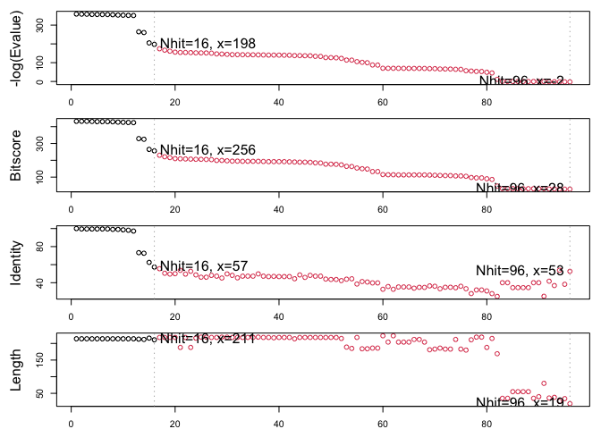
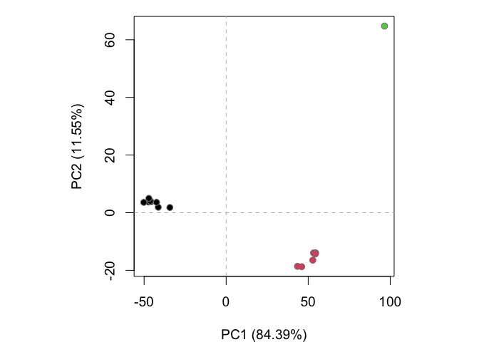

Class 09: Structural Bioinformatics 1
================
Angela Liu

## What is in the PDB anyway?

The main database of biomolecular structures is called the PDB and is
available at www.rcsb.org.

Let’s begin by seeing what is in this database:

``` r
#pdbstats <- read.csv("/Users/angelaliu/Documents/bimm143/class09/PDB.csv", row.names = 1)
pdbstats <- read.csv("pdb.csv", row.names = 1)
head(pdbstats)
```

                              X.ray    EM    NMR Multiple.methods Neutron Other
    Protein (only)          152,809 9,421 12,117              191      72    32
    Protein/Oligosaccharide   9,008 1,654     32                7       1     0
    Protein/NA                8,061 2,944    281                6       0     0
    Nucleic acid (only)       2,602    77  1,433               12       2     1
    Other                       163     9     31                0       0     0
    Oligosaccharide (only)       11     0      6                1       0     4
                              Total
    Protein (only)          174,642
    Protein/Oligosaccharide  10,702
    Protein/NA               11,292
    Nucleic acid (only)       4,127
    Other                       203
    Oligosaccharide (only)       22

> Q1: What percentage of structures in the PDB are solved by X-Ray and
> Electron Microscopy.

There’s an issue where the data inputs are all strings, as opposed to
integers. We use `gsub()` to remove the commas from the numbers and
`as.numeric()` to convert the strings to integers.

``` r
#remove the commas from the numbers 
#convert string to numbers
n.xray <- sum(as.numeric(gsub(",", "", pdbstats$X.ray)))
n.xray
```

    [1] 172654

``` r
n.em <- sum(as.numeric(gsub(",", "", pdbstats$EM)))
n.em
```

    [1] 14105

``` r
total <- sum(as.numeric(gsub(",", "", pdbstats$Total)))
total
```

    [1] 200988

``` r
#calculating percentages with two significant figures
perXray <- round((n.xray/total) * 100, 2)
perEM <- round((n.em/total) * 100,2)
perXray
```

    [1] 85.9

``` r
perEM
```

    [1] 7.02

85.9% of the structures are solved by X-Ray while 7.02% are solved by
EM.

> Q2: What proportion of structures in the PDB are protein?

``` r
as.numeric(gsub(",", "", pdbstats$Total))/total
```

    [1] 0.8689175473 0.0532469600 0.0561824587 0.0205335642 0.0010100105
    [6] 0.0001094593

The first element represents the proportion of structures that are
protein (only), 86.9%.

> Q3: Type HIV in the PDB website search box on the home page and
> determine how many HIV-1 protease structures are in the current PDB?

There are 200,988 search results from HIV-1 protease structures. It’s
hard to straightforwardly find all HIV-1 protease structures with plain
text on the database.

## Visualizing the HIV-1 Protease Structure

> Q4: Water molecules normally have 3 atoms. Why do we see just one atom
> per water molecule in this structure?

We only see one atom per water molecule because hydrogen is too small
for the resolution.

> Q5: There is a critical “conserved” water molecule in the binding
> site. Can you identify this water molecule? What residue number does
> this water molecule have?

Yes, the water molecule is at residue number 308.


> Q6: Generate and save a figure clearly showing the two distinct chains
> of HIV-protease along with the ligand. You might also consider showing
> the catalytic residues ASP 25 in each chain and the critical water (we
> recommend “Ball & Stick” for these side-chains). Add this figure to
> your Quarto document. Discussion Topic: Can you think of a way in
> which indinavir, or even larger ligands and substrates, could enter
> the binding site?

 

## Intro to Bio3D

We will use the `bio3d` package for this:

``` r
library(bio3d)
```

Read a PDB file from the online database.

``` r
pdb <- read.pdb("1hsg")
```

      Note: Accessing on-line PDB file

``` r
# get a quick summary of the pdb file
pdb
```


     Call:  read.pdb(file = "1hsg")

       Total Models#: 1
         Total Atoms#: 1686,  XYZs#: 5058  Chains#: 2  (values: A B)

         Protein Atoms#: 1514  (residues/Calpha atoms#: 198)
         Nucleic acid Atoms#: 0  (residues/phosphate atoms#: 0)

         Non-protein/nucleic Atoms#: 172  (residues: 128)
         Non-protein/nucleic resid values: [ HOH (127), MK1 (1) ]

       Protein sequence:
          PQITLWQRPLVTIKIGGQLKEALLDTGADDTVLEEMSLPGRWKPKMIGGIGGFIKVRQYD
          QILIEICGHKAIGTVLVGPTPVNIIGRNLLTQIGCTLNFPQITLWQRPLVTIKIGGQLKE
          ALLDTGADDTVLEEMSLPGRWKPKMIGGIGGFIKVRQYDQILIEICGHKAIGTVLVGPTP
          VNIIGRNLLTQIGCTLNF

    + attr: atom, xyz, seqres, helix, sheet,
            calpha, remark, call

``` r
head(pdb$atom)
```

      type eleno elety  alt resid chain resno insert      x      y     z o     b
    1 ATOM     1     N <NA>   PRO     A     1   <NA> 29.361 39.686 5.862 1 38.10
    2 ATOM     2    CA <NA>   PRO     A     1   <NA> 30.307 38.663 5.319 1 40.62
    3 ATOM     3     C <NA>   PRO     A     1   <NA> 29.760 38.071 4.022 1 42.64
    4 ATOM     4     O <NA>   PRO     A     1   <NA> 28.600 38.302 3.676 1 43.40
    5 ATOM     5    CB <NA>   PRO     A     1   <NA> 30.508 37.541 6.342 1 37.87
    6 ATOM     6    CG <NA>   PRO     A     1   <NA> 29.296 37.591 7.162 1 38.40
      segid elesy charge
    1  <NA>     N   <NA>
    2  <NA>     C   <NA>
    3  <NA>     C   <NA>
    4  <NA>     O   <NA>
    5  <NA>     C   <NA>
    6  <NA>     C   <NA>

What is the first residue 3 letter code and 1 letter code?

``` r
# residue 3 letter code
pdb$atom$resid[1]
```

    [1] "PRO"

``` r
# residue w 1 letter code
aa321(pdb$atom$resid[1])
```

    [1] "P"

> Q7: How many amino acid residues are there in this pdb object?

198 amino acid residues

> Q8: Name one of the two non-protein residues?

water(HOH) and MK1

> Q9: How many protein chains are in this structure?

There are 2 protein chains in the structure.

## Predicting functional motions of a single structure

Reading in a new PDB structure of adenylate kinase (PDB code: 6s36) and
using normal mode analysis (NMA) to predict the protein flexibility and
potential functional motions.

``` r
adk <- read.pdb("6s36")
```

      Note: Accessing on-line PDB file
       PDB has ALT records, taking A only, rm.alt=TRUE

``` r
adk
```


     Call:  read.pdb(file = "6s36")

       Total Models#: 1
         Total Atoms#: 1898,  XYZs#: 5694  Chains#: 1  (values: A)

         Protein Atoms#: 1654  (residues/Calpha atoms#: 214)
         Nucleic acid Atoms#: 0  (residues/phosphate atoms#: 0)

         Non-protein/nucleic Atoms#: 244  (residues: 244)
         Non-protein/nucleic resid values: [ CL (3), HOH (238), MG (2), NA (1) ]

       Protein sequence:
          MRIILLGAPGAGKGTQAQFIMEKYGIPQISTGDMLRAAVKSGSELGKQAKDIMDAGKLVT
          DELVIALVKERIAQEDCRNGFLLDGFPRTIPQADAMKEAGINVDYVLEFDVPDELIVDKI
          VGRRVHAPSGRVYHVKFNPPKVEGKDDVTGEELTTRKDDQEETVRKRLVEYHQMTAPLIG
          YYSKEAEAGNTKYAKVDGTKPVAEVRADLEKILG

    + attr: atom, xyz, seqres, helix, sheet,
            calpha, remark, call

Normal mode analysis (NMA) is a structural bioinformatics method to
predict protein flexibility and potential functional motions (a.k.a.
conformational changes).

``` r
# Perform flexiblity prediction
m <- nma(adk)
```

     Building Hessian...        Done in 0.034 seconds.
     Diagonalizing Hessian...   Done in 0.625 seconds.

``` r
plot(m)
```


The peaks show the most flexible residues.

To view a “movie” of these predicted motions we can generate a molecular
“trajectory” with the `mktrj()` function.

``` r
mktrj(m, file="adk_m7.pdb")
```

## Section 4: Comparative structure analysis of Adk

Today we are continuing were we left off last day building towards
completing the loop from biomolecular structural data to our new
analysis methods like PCA and clustering.

Prepping for this section and downloading in the R console:

``` r
# Install packages in the R console NOT your Rmd/Quarto file

#install.packages("bio3d")
#install.packages("devtools")
#install.packages("BiocManager")

#BiocManager::install("msa")
#devtools::install_bitbucket("Grantlab/bio3d-view")
```

> Q10. Which of the packages above is found only on BioConductor and not
> CRAN?

msa is found only in BioConductor and not CRAN as it uses a different
line of code to download specifically in BiocManager,
`BiocManager::install("msa")`.

> Q11. Which of the above packages is not found on BioConductor or
> CRAN?:

bio3d-view

> Q12. True or False? Functions from the devtools package can be used to
> install packages from GitHub and BitBucket?

TRUE

``` r
library(bio3d)
aa <- get.seq("1ake_A")
```

    Warning in get.seq("1ake_A"): Removing existing file: seqs.fasta

    Fetching... Please wait. Done.

> Q13. How many amino acids are in this sequence, i.e. how long is this
> sequence?

There are 214 amino acid sequences.

``` r
# Blast or hmmer search 
# b <- blast.pdb(aa)
```

I could save and load my blast results next time so I don’t need to run
the search every time.

`saveRDS()` makes a compressed small size object that contains BLAST
results.

``` r
# comment out this code because it needs the b as reference for when it runs the first time
# saveRDS(b, file = "blast_results.RDS")
```

``` r
b <- readRDS("blast_results.RDS")
```

A summary plot of our BLAST results

``` r
# Plot a summary of search results
hits <- plot(b)
```

      * Possible cutoff values:    197 -3 
                Yielding Nhits:    16 96 

      * Chosen cutoff value of:    197 
                Yielding Nhits:    16 



``` r
hits
```

    $hits
       pdb.id   acc      group
    1  "1AKE_A" "1AKE_A" "1"  
    2  "4X8M_A" "4X8M_A" "1"  
    3  "6S36_A" "6S36_A" "1"  
    4  "6RZE_A" "6RZE_A" "1"  
    5  "4X8H_A" "4X8H_A" "1"  
    6  "3HPR_A" "3HPR_A" "1"  
    7  "1E4V_A" "1E4V_A" "1"  
    8  "5EJE_A" "5EJE_A" "1"  
    9  "1E4Y_A" "1E4Y_A" "1"  
    10 "3X2S_A" "3X2S_A" "1"  
    11 "6HAP_A" "6HAP_A" "1"  
    12 "6HAM_A" "6HAM_A" "1"  
    13 "4K46_A" "4K46_A" "1"  
    14 "4NP6_A" "4NP6_A" "1"  
    15 "3GMT_A" "3GMT_A" "1"  
    16 "4PZL_A" "4PZL_A" "1"  

    $pdb.id
     [1] "1AKE_A" "4X8M_A" "6S36_A" "6RZE_A" "4X8H_A" "3HPR_A" "1E4V_A" "5EJE_A"
     [9] "1E4Y_A" "3X2S_A" "6HAP_A" "6HAM_A" "4K46_A" "4NP6_A" "3GMT_A" "4PZL_A"

    $acc
     [1] "1AKE_A" "4X8M_A" "6S36_A" "6RZE_A" "4X8H_A" "3HPR_A" "1E4V_A" "5EJE_A"
     [9] "1E4Y_A" "3X2S_A" "6HAP_A" "6HAM_A" "4K46_A" "4NP6_A" "3GMT_A" "4PZL_A"

    $inds
     [1]  TRUE  TRUE  TRUE  TRUE  TRUE  TRUE  TRUE  TRUE  TRUE  TRUE  TRUE  TRUE
    [13]  TRUE  TRUE  TRUE  TRUE FALSE FALSE FALSE FALSE FALSE FALSE FALSE FALSE
    [25] FALSE FALSE FALSE FALSE FALSE FALSE FALSE FALSE FALSE FALSE FALSE FALSE
    [37] FALSE FALSE FALSE FALSE FALSE FALSE FALSE FALSE FALSE FALSE FALSE FALSE
    [49] FALSE FALSE FALSE FALSE FALSE FALSE FALSE FALSE FALSE FALSE FALSE FALSE
    [61] FALSE FALSE FALSE FALSE FALSE FALSE FALSE FALSE FALSE FALSE FALSE FALSE
    [73] FALSE FALSE FALSE FALSE FALSE FALSE FALSE FALSE FALSE FALSE FALSE FALSE
    [85] FALSE FALSE FALSE FALSE FALSE FALSE FALSE FALSE FALSE FALSE FALSE FALSE

    attr(,"class")
    [1] "blast"

``` r
# List out some 'top hits'
head(hits$pdb.id)
```

    [1] "1AKE_A" "4X8M_A" "6S36_A" "6RZE_A" "4X8H_A" "3HPR_A"

``` r
# Download related PDB files
# path makes a subfolder called "pdbs" where the pdb files will be downloaded into, gzip makes compressed zip files
files <- get.pdb(hits$pdb.id, path="pdbs", split=TRUE, gzip=TRUE)
```

    Warning in get.pdb(hits$pdb.id, path = "pdbs", split = TRUE, gzip = TRUE):
    pdbs/1AKE.pdb.gz exists. Skipping download

    Warning in get.pdb(hits$pdb.id, path = "pdbs", split = TRUE, gzip = TRUE):
    pdbs/4X8M.pdb.gz exists. Skipping download

    Warning in get.pdb(hits$pdb.id, path = "pdbs", split = TRUE, gzip = TRUE):
    pdbs/6S36.pdb.gz exists. Skipping download

    Warning in get.pdb(hits$pdb.id, path = "pdbs", split = TRUE, gzip = TRUE):
    pdbs/6RZE.pdb.gz exists. Skipping download

    Warning in get.pdb(hits$pdb.id, path = "pdbs", split = TRUE, gzip = TRUE):
    pdbs/4X8H.pdb.gz exists. Skipping download

    Warning in get.pdb(hits$pdb.id, path = "pdbs", split = TRUE, gzip = TRUE):
    pdbs/3HPR.pdb.gz exists. Skipping download

    Warning in get.pdb(hits$pdb.id, path = "pdbs", split = TRUE, gzip = TRUE):
    pdbs/1E4V.pdb.gz exists. Skipping download

    Warning in get.pdb(hits$pdb.id, path = "pdbs", split = TRUE, gzip = TRUE):
    pdbs/5EJE.pdb.gz exists. Skipping download

    Warning in get.pdb(hits$pdb.id, path = "pdbs", split = TRUE, gzip = TRUE):
    pdbs/1E4Y.pdb.gz exists. Skipping download

    Warning in get.pdb(hits$pdb.id, path = "pdbs", split = TRUE, gzip = TRUE):
    pdbs/3X2S.pdb.gz exists. Skipping download

    Warning in get.pdb(hits$pdb.id, path = "pdbs", split = TRUE, gzip = TRUE):
    pdbs/6HAP.pdb.gz exists. Skipping download

    Warning in get.pdb(hits$pdb.id, path = "pdbs", split = TRUE, gzip = TRUE):
    pdbs/6HAM.pdb.gz exists. Skipping download

    Warning in get.pdb(hits$pdb.id, path = "pdbs", split = TRUE, gzip = TRUE):
    pdbs/4K46.pdb.gz exists. Skipping download

    Warning in get.pdb(hits$pdb.id, path = "pdbs", split = TRUE, gzip = TRUE):
    pdbs/4NP6.pdb.gz exists. Skipping download

    Warning in get.pdb(hits$pdb.id, path = "pdbs", split = TRUE, gzip = TRUE):
    pdbs/3GMT.pdb.gz exists. Skipping download

    Warning in get.pdb(hits$pdb.id, path = "pdbs", split = TRUE, gzip = TRUE):
    pdbs/4PZL.pdb.gz exists. Skipping download


      |                                                                            
      |                                                                      |   0%
      |                                                                            
      |====                                                                  |   6%
      |                                                                            
      |=========                                                             |  12%
      |                                                                            
      |=============                                                         |  19%
      |                                                                            
      |==================                                                    |  25%
      |                                                                            
      |======================                                                |  31%
      |                                                                            
      |==========================                                            |  38%
      |                                                                            
      |===============================                                       |  44%
      |                                                                            
      |===================================                                   |  50%
      |                                                                            
      |=======================================                               |  56%
      |                                                                            
      |============================================                          |  62%
      |                                                                            
      |================================================                      |  69%
      |                                                                            
      |====================================================                  |  75%
      |                                                                            
      |=========================================================             |  81%
      |                                                                            
      |=============================================================         |  88%
      |                                                                            
      |==================================================================    |  94%
      |                                                                            
      |======================================================================| 100%

Next we are going to align and superpose all these structures:

``` r
# Align related PDBs
# fit = TRUE to superpose
# use msa package to do the alignment; diff alignment methods
pdbs <- pdbaln(files, fit = TRUE, exefile="msa")
```

    Reading PDB files:
    pdbs/split_chain/1AKE_A.pdb
    pdbs/split_chain/4X8M_A.pdb
    pdbs/split_chain/6S36_A.pdb
    pdbs/split_chain/6RZE_A.pdb
    pdbs/split_chain/4X8H_A.pdb
    pdbs/split_chain/3HPR_A.pdb
    pdbs/split_chain/1E4V_A.pdb
    pdbs/split_chain/5EJE_A.pdb
    pdbs/split_chain/1E4Y_A.pdb
    pdbs/split_chain/3X2S_A.pdb
    pdbs/split_chain/6HAP_A.pdb
    pdbs/split_chain/6HAM_A.pdb
    pdbs/split_chain/4K46_A.pdb
    pdbs/split_chain/4NP6_A.pdb
    pdbs/split_chain/3GMT_A.pdb
    pdbs/split_chain/4PZL_A.pdb
       PDB has ALT records, taking A only, rm.alt=TRUE
    ..   PDB has ALT records, taking A only, rm.alt=TRUE
    .   PDB has ALT records, taking A only, rm.alt=TRUE
    ..   PDB has ALT records, taking A only, rm.alt=TRUE
    ..   PDB has ALT records, taking A only, rm.alt=TRUE
    ....   PDB has ALT records, taking A only, rm.alt=TRUE
    .   PDB has ALT records, taking A only, rm.alt=TRUE
    ....

    Extracting sequences

    pdb/seq: 1   name: pdbs/split_chain/1AKE_A.pdb 
       PDB has ALT records, taking A only, rm.alt=TRUE
    pdb/seq: 2   name: pdbs/split_chain/4X8M_A.pdb 
    pdb/seq: 3   name: pdbs/split_chain/6S36_A.pdb 
       PDB has ALT records, taking A only, rm.alt=TRUE
    pdb/seq: 4   name: pdbs/split_chain/6RZE_A.pdb 
       PDB has ALT records, taking A only, rm.alt=TRUE
    pdb/seq: 5   name: pdbs/split_chain/4X8H_A.pdb 
    pdb/seq: 6   name: pdbs/split_chain/3HPR_A.pdb 
       PDB has ALT records, taking A only, rm.alt=TRUE
    pdb/seq: 7   name: pdbs/split_chain/1E4V_A.pdb 
    pdb/seq: 8   name: pdbs/split_chain/5EJE_A.pdb 
       PDB has ALT records, taking A only, rm.alt=TRUE
    pdb/seq: 9   name: pdbs/split_chain/1E4Y_A.pdb 
    pdb/seq: 10   name: pdbs/split_chain/3X2S_A.pdb 
    pdb/seq: 11   name: pdbs/split_chain/6HAP_A.pdb 
    pdb/seq: 12   name: pdbs/split_chain/6HAM_A.pdb 
       PDB has ALT records, taking A only, rm.alt=TRUE
    pdb/seq: 13   name: pdbs/split_chain/4K46_A.pdb 
       PDB has ALT records, taking A only, rm.alt=TRUE
    pdb/seq: 14   name: pdbs/split_chain/4NP6_A.pdb 
    pdb/seq: 15   name: pdbs/split_chain/3GMT_A.pdb 
    pdb/seq: 16   name: pdbs/split_chain/4PZL_A.pdb 

``` r
pdbs
```

                                    1        .         .         .         40 
    [Truncated_Name:1]1AKE_A.pdb    ----------MRIILLGAPGAGKGTQAQFIMEKYGIPQIS
    [Truncated_Name:2]4X8M_A.pdb    ----------MRIILLGAPGAGKGTQAQFIMEKYGIPQIS
    [Truncated_Name:3]6S36_A.pdb    ----------MRIILLGAPGAGKGTQAQFIMEKYGIPQIS
    [Truncated_Name:4]6RZE_A.pdb    ----------MRIILLGAPGAGKGTQAQFIMEKYGIPQIS
    [Truncated_Name:5]4X8H_A.pdb    ----------MRIILLGAPGAGKGTQAQFIMEKYGIPQIS
    [Truncated_Name:6]3HPR_A.pdb    ----------MRIILLGAPGAGKGTQAQFIMEKYGIPQIS
    [Truncated_Name:7]1E4V_A.pdb    ----------MRIILLGAPVAGKGTQAQFIMEKYGIPQIS
    [Truncated_Name:8]5EJE_A.pdb    ----------MRIILLGAPGAGKGTQAQFIMEKYGIPQIS
    [Truncated_Name:9]1E4Y_A.pdb    ----------MRIILLGALVAGKGTQAQFIMEKYGIPQIS
    [Truncated_Name:10]3X2S_A.pdb   ----------MRIILLGAPGAGKGTQAQFIMEKYGIPQIS
    [Truncated_Name:11]6HAP_A.pdb   ----------MRIILLGAPGAGKGTQAQFIMEKYGIPQIS
    [Truncated_Name:12]6HAM_A.pdb   ----------MRIILLGAPGAGKGTQAQFIMEKYGIPQIS
    [Truncated_Name:13]4K46_A.pdb   ----------MRIILLGAPGAGKGTQAQFIMAKFGIPQIS
    [Truncated_Name:14]4NP6_A.pdb   --------NAMRIILLGAPGAGKGTQAQFIMEKFGIPQIS
    [Truncated_Name:15]3GMT_A.pdb   ----------MRLILLGAPGAGKGTQANFIKEKFGIPQIS
    [Truncated_Name:16]4PZL_A.pdb   TENLYFQSNAMRIILLGAPGAGKGTQAKIIEQKYNIAHIS
                                              **^*****  *******  *  *^ *  ** 
                                    1        .         .         .         40 

                                   41        .         .         .         80 
    [Truncated_Name:1]1AKE_A.pdb    TGDMLRAAVKSGSELGKQAKDIMDAGKLVTDELVIALVKE
    [Truncated_Name:2]4X8M_A.pdb    TGDMLRAAVKSGSELGKQAKDIMDAGKLVTDELVIALVKE
    [Truncated_Name:3]6S36_A.pdb    TGDMLRAAVKSGSELGKQAKDIMDAGKLVTDELVIALVKE
    [Truncated_Name:4]6RZE_A.pdb    TGDMLRAAVKSGSELGKQAKDIMDAGKLVTDELVIALVKE
    [Truncated_Name:5]4X8H_A.pdb    TGDMLRAAVKSGSELGKQAKDIMDAGKLVTDELVIALVKE
    [Truncated_Name:6]3HPR_A.pdb    TGDMLRAAVKSGSELGKQAKDIMDAGKLVTDELVIALVKE
    [Truncated_Name:7]1E4V_A.pdb    TGDMLRAAVKSGSELGKQAKDIMDAGKLVTDELVIALVKE
    [Truncated_Name:8]5EJE_A.pdb    TGDMLRAAVKSGSELGKQAKDIMDACKLVTDELVIALVKE
    [Truncated_Name:9]1E4Y_A.pdb    TGDMLRAAVKSGSELGKQAKDIMDAGKLVTDELVIALVKE
    [Truncated_Name:10]3X2S_A.pdb   TGDMLRAAVKSGSELGKQAKDIMDCGKLVTDELVIALVKE
    [Truncated_Name:11]6HAP_A.pdb   TGDMLRAAVKSGSELGKQAKDIMDAGKLVTDELVIALVRE
    [Truncated_Name:12]6HAM_A.pdb   TGDMLRAAIKSGSELGKQAKDIMDAGKLVTDEIIIALVKE
    [Truncated_Name:13]4K46_A.pdb   TGDMLRAAIKAGTELGKQAKSVIDAGQLVSDDIILGLVKE
    [Truncated_Name:14]4NP6_A.pdb   TGDMLRAAIKAGTELGKQAKAVIDAGQLVSDDIILGLIKE
    [Truncated_Name:15]3GMT_A.pdb   TGDMLRAAVKAGTPLGVEAKTYMDEGKLVPDSLIIGLVKE
    [Truncated_Name:16]4PZL_A.pdb   TGDMIRETIKSGSALGQELKKVLDAGELVSDEFIIKIVKD
                                    ****^*  ^* *^ **   *  ^*   ** *  ^^ ^^^^ 
                                   41        .         .         .         80 

                                   81        .         .         .         120 
    [Truncated_Name:1]1AKE_A.pdb    RIAQEDCRNGFLLDGFPRTIPQADAMKEAGINVDYVLEFD
    [Truncated_Name:2]4X8M_A.pdb    RIAQEDCRNGFLLDGFPRTIPQADAMKEAGINVDYVLEFD
    [Truncated_Name:3]6S36_A.pdb    RIAQEDCRNGFLLDGFPRTIPQADAMKEAGINVDYVLEFD
    [Truncated_Name:4]6RZE_A.pdb    RIAQEDCRNGFLLDGFPRTIPQADAMKEAGINVDYVLEFD
    [Truncated_Name:5]4X8H_A.pdb    RIAQEDCRNGFLLDGFPRTIPQADAMKEAGINVDYVLEFD
    [Truncated_Name:6]3HPR_A.pdb    RIAQEDCRNGFLLDGFPRTIPQADAMKEAGINVDYVLEFD
    [Truncated_Name:7]1E4V_A.pdb    RIAQEDCRNGFLLDGFPRTIPQADAMKEAGINVDYVLEFD
    [Truncated_Name:8]5EJE_A.pdb    RIAQEDCRNGFLLDGFPRTIPQADAMKEAGINVDYVLEFD
    [Truncated_Name:9]1E4Y_A.pdb    RIAQEDCRNGFLLDGFPRTIPQADAMKEAGINVDYVLEFD
    [Truncated_Name:10]3X2S_A.pdb   RIAQEDSRNGFLLDGFPRTIPQADAMKEAGINVDYVLEFD
    [Truncated_Name:11]6HAP_A.pdb   RICQEDSRNGFLLDGFPRTIPQADAMKEAGINVDYVLEFD
    [Truncated_Name:12]6HAM_A.pdb   RICQEDSRNGFLLDGFPRTIPQADAMKEAGINVDYVLEFD
    [Truncated_Name:13]4K46_A.pdb   RIAQDDCAKGFLLDGFPRTIPQADGLKEVGVVVDYVIEFD
    [Truncated_Name:14]4NP6_A.pdb   RIAQADCEKGFLLDGFPRTIPQADGLKEMGINVDYVIEFD
    [Truncated_Name:15]3GMT_A.pdb   RLKEADCANGYLFDGFPRTIAQADAMKEAGVAIDYVLEID
    [Truncated_Name:16]4PZL_A.pdb   RISKNDCNNGFLLDGVPRTIPQAQELDKLGVNIDYIVEVD
                                    *^   *   *^* ** **** **  ^   *^ ^**^^* * 
                                   81        .         .         .         120 

                                  121        .         .         .         160 
    [Truncated_Name:1]1AKE_A.pdb    VPDELIVDRIVGRRVHAPSGRVYHVKFNPPKVEGKDDVTG
    [Truncated_Name:2]4X8M_A.pdb    VPDELIVDRIVGRRVHAPSGRVYHVKFNPPKVEGKDDVTG
    [Truncated_Name:3]6S36_A.pdb    VPDELIVDKIVGRRVHAPSGRVYHVKFNPPKVEGKDDVTG
    [Truncated_Name:4]6RZE_A.pdb    VPDELIVDAIVGRRVHAPSGRVYHVKFNPPKVEGKDDVTG
    [Truncated_Name:5]4X8H_A.pdb    VPDELIVDRIVGRRVHAPSGRVYHVKFNPPKVEGKDDVTG
    [Truncated_Name:6]3HPR_A.pdb    VPDELIVDRIVGRRVHAPSGRVYHVKFNPPKVEGKDDGTG
    [Truncated_Name:7]1E4V_A.pdb    VPDELIVDRIVGRRVHAPSGRVYHVKFNPPKVEGKDDVTG
    [Truncated_Name:8]5EJE_A.pdb    VPDELIVDRIVGRRVHAPSGRVYHVKFNPPKVEGKDDVTG
    [Truncated_Name:9]1E4Y_A.pdb    VPDELIVDRIVGRRVHAPSGRVYHVKFNPPKVEGKDDVTG
    [Truncated_Name:10]3X2S_A.pdb   VPDELIVDRIVGRRVHAPSGRVYHVKFNPPKVEGKDDVTG
    [Truncated_Name:11]6HAP_A.pdb   VPDELIVDRIVGRRVHAPSGRVYHVKFNPPKVEGKDDVTG
    [Truncated_Name:12]6HAM_A.pdb   VPDELIVDRIVGRRVHAPSGRVYHVKFNPPKVEGKDDVTG
    [Truncated_Name:13]4K46_A.pdb   VADSVIVERMAGRRAHLASGRTYHNVYNPPKVEGKDDVTG
    [Truncated_Name:14]4NP6_A.pdb   VADDVIVERMAGRRAHLPSGRTYHVVYNPPKVEGKDDVTG
    [Truncated_Name:15]3GMT_A.pdb   VPFSEIIERMSGRRTHPASGRTYHVKFNPPKVEGKDDVTG
    [Truncated_Name:16]4PZL_A.pdb   VADNLLIERITGRRIHPASGRTYHTKFNPPKVADKDDVTG
                                    *    ^^^ ^ *** *  *** **  ^*****  *** ** 
                                  121        .         .         .         160 

                                  161        .         .         .         200 
    [Truncated_Name:1]1AKE_A.pdb    EELTTRKDDQEETVRKRLVEYHQMTAPLIGYYSKEAEAGN
    [Truncated_Name:2]4X8M_A.pdb    EELTTRKDDQEETVRKRLVEWHQMTAPLIGYYSKEAEAGN
    [Truncated_Name:3]6S36_A.pdb    EELTTRKDDQEETVRKRLVEYHQMTAPLIGYYSKEAEAGN
    [Truncated_Name:4]6RZE_A.pdb    EELTTRKDDQEETVRKRLVEYHQMTAPLIGYYSKEAEAGN
    [Truncated_Name:5]4X8H_A.pdb    EELTTRKDDQEETVRKRLVEYHQMTAALIGYYSKEAEAGN
    [Truncated_Name:6]3HPR_A.pdb    EELTTRKDDQEETVRKRLVEYHQMTAPLIGYYSKEAEAGN
    [Truncated_Name:7]1E4V_A.pdb    EELTTRKDDQEETVRKRLVEYHQMTAPLIGYYSKEAEAGN
    [Truncated_Name:8]5EJE_A.pdb    EELTTRKDDQEECVRKRLVEYHQMTAPLIGYYSKEAEAGN
    [Truncated_Name:9]1E4Y_A.pdb    EELTTRKDDQEETVRKRLVEYHQMTAPLIGYYSKEAEAGN
    [Truncated_Name:10]3X2S_A.pdb   EELTTRKDDQEETVRKRLCEYHQMTAPLIGYYSKEAEAGN
    [Truncated_Name:11]6HAP_A.pdb   EELTTRKDDQEETVRKRLVEYHQMTAPLIGYYSKEAEAGN
    [Truncated_Name:12]6HAM_A.pdb   EELTTRKDDQEETVRKRLVEYHQMTAPLIGYYSKEAEAGN
    [Truncated_Name:13]4K46_A.pdb   EDLVIREDDKEETVLARLGVYHNQTAPLIAYYGKEAEAGN
    [Truncated_Name:14]4NP6_A.pdb   EDLVIREDDKEETVRARLNVYHTQTAPLIEYYGKEAAAGK
    [Truncated_Name:15]3GMT_A.pdb   EPLVQRDDDKEETVKKRLDVYEAQTKPLITYYGDWARRGA
    [Truncated_Name:16]4PZL_A.pdb   EPLITRTDDNEDTVKQRLSVYHAQTAKLIDFYRNFSSTNT
                                    * *  * ** *^ *  **  ^   *  ** ^*         
                                  161        .         .         .         200 

                                  201        .         .      227 
    [Truncated_Name:1]1AKE_A.pdb    T--KYAKVDGTKPVAEVRADLEKILG-
    [Truncated_Name:2]4X8M_A.pdb    T--KYAKVDGTKPVAEVRADLEKILG-
    [Truncated_Name:3]6S36_A.pdb    T--KYAKVDGTKPVAEVRADLEKILG-
    [Truncated_Name:4]6RZE_A.pdb    T--KYAKVDGTKPVAEVRADLEKILG-
    [Truncated_Name:5]4X8H_A.pdb    T--KYAKVDGTKPVAEVRADLEKILG-
    [Truncated_Name:6]3HPR_A.pdb    T--KYAKVDGTKPVAEVRADLEKILG-
    [Truncated_Name:7]1E4V_A.pdb    T--KYAKVDGTKPVAEVRADLEKILG-
    [Truncated_Name:8]5EJE_A.pdb    T--KYAKVDGTKPVAEVRADLEKILG-
    [Truncated_Name:9]1E4Y_A.pdb    T--KYAKVDGTKPVAEVRADLEKILG-
    [Truncated_Name:10]3X2S_A.pdb   T--KYAKVDGTKPVAEVRADLEKILG-
    [Truncated_Name:11]6HAP_A.pdb   T--KYAKVDGTKPVCEVRADLEKILG-
    [Truncated_Name:12]6HAM_A.pdb   T--KYAKVDGTKPVCEVRADLEKILG-
    [Truncated_Name:13]4K46_A.pdb   T--QYLKFDGTKAVAEVSAELEKALA-
    [Truncated_Name:14]4NP6_A.pdb   T--QYLKFDGTKQVSEVSADIAKALA-
    [Truncated_Name:15]3GMT_A.pdb   E-------NGLKAPA-----YRKISG-
    [Truncated_Name:16]4PZL_A.pdb   KIPKYIKINGDQAVEKVSQDIFDQLNK
                                             *                  
                                  201        .         .      227 

    Call:
      pdbaln(files = files, fit = TRUE, exefile = "msa")

    Class:
      pdbs, fasta

    Alignment dimensions:
      16 sequence rows; 227 position columns (204 non-gap, 23 gap) 

    + attr: xyz, resno, b, chain, id, ali, resid, sse, call

``` r
# to show the alignment
pdbs$ali
```

                                [,1] [,2] [,3] [,4] [,5] [,6] [,7] [,8] [,9] [,10]
    pdbs/split_chain/1AKE_A.pdb "-"  "-"  "-"  "-"  "-"  "-"  "-"  "-"  "-"  "-"  
    pdbs/split_chain/4X8M_A.pdb "-"  "-"  "-"  "-"  "-"  "-"  "-"  "-"  "-"  "-"  
    pdbs/split_chain/6S36_A.pdb "-"  "-"  "-"  "-"  "-"  "-"  "-"  "-"  "-"  "-"  
    pdbs/split_chain/6RZE_A.pdb "-"  "-"  "-"  "-"  "-"  "-"  "-"  "-"  "-"  "-"  
    pdbs/split_chain/4X8H_A.pdb "-"  "-"  "-"  "-"  "-"  "-"  "-"  "-"  "-"  "-"  
    pdbs/split_chain/3HPR_A.pdb "-"  "-"  "-"  "-"  "-"  "-"  "-"  "-"  "-"  "-"  
    pdbs/split_chain/1E4V_A.pdb "-"  "-"  "-"  "-"  "-"  "-"  "-"  "-"  "-"  "-"  
    pdbs/split_chain/5EJE_A.pdb "-"  "-"  "-"  "-"  "-"  "-"  "-"  "-"  "-"  "-"  
    pdbs/split_chain/1E4Y_A.pdb "-"  "-"  "-"  "-"  "-"  "-"  "-"  "-"  "-"  "-"  
    pdbs/split_chain/3X2S_A.pdb "-"  "-"  "-"  "-"  "-"  "-"  "-"  "-"  "-"  "-"  
    pdbs/split_chain/6HAP_A.pdb "-"  "-"  "-"  "-"  "-"  "-"  "-"  "-"  "-"  "-"  
    pdbs/split_chain/6HAM_A.pdb "-"  "-"  "-"  "-"  "-"  "-"  "-"  "-"  "-"  "-"  
    pdbs/split_chain/4K46_A.pdb "-"  "-"  "-"  "-"  "-"  "-"  "-"  "-"  "-"  "-"  
    pdbs/split_chain/4NP6_A.pdb "-"  "-"  "-"  "-"  "-"  "-"  "-"  "-"  "N"  "A"  
    pdbs/split_chain/3GMT_A.pdb "-"  "-"  "-"  "-"  "-"  "-"  "-"  "-"  "-"  "-"  
    pdbs/split_chain/4PZL_A.pdb "T"  "E"  "N"  "L"  "Y"  "F"  "Q"  "S"  "N"  "A"  
                                [,11] [,12] [,13] [,14] [,15] [,16] [,17] [,18]
    pdbs/split_chain/1AKE_A.pdb "M"   "R"   "I"   "I"   "L"   "L"   "G"   "A"  
    pdbs/split_chain/4X8M_A.pdb "M"   "R"   "I"   "I"   "L"   "L"   "G"   "A"  
    pdbs/split_chain/6S36_A.pdb "M"   "R"   "I"   "I"   "L"   "L"   "G"   "A"  
    pdbs/split_chain/6RZE_A.pdb "M"   "R"   "I"   "I"   "L"   "L"   "G"   "A"  
    pdbs/split_chain/4X8H_A.pdb "M"   "R"   "I"   "I"   "L"   "L"   "G"   "A"  
    pdbs/split_chain/3HPR_A.pdb "M"   "R"   "I"   "I"   "L"   "L"   "G"   "A"  
    pdbs/split_chain/1E4V_A.pdb "M"   "R"   "I"   "I"   "L"   "L"   "G"   "A"  
    pdbs/split_chain/5EJE_A.pdb "M"   "R"   "I"   "I"   "L"   "L"   "G"   "A"  
    pdbs/split_chain/1E4Y_A.pdb "M"   "R"   "I"   "I"   "L"   "L"   "G"   "A"  
    pdbs/split_chain/3X2S_A.pdb "M"   "R"   "I"   "I"   "L"   "L"   "G"   "A"  
    pdbs/split_chain/6HAP_A.pdb "M"   "R"   "I"   "I"   "L"   "L"   "G"   "A"  
    pdbs/split_chain/6HAM_A.pdb "M"   "R"   "I"   "I"   "L"   "L"   "G"   "A"  
    pdbs/split_chain/4K46_A.pdb "M"   "R"   "I"   "I"   "L"   "L"   "G"   "A"  
    pdbs/split_chain/4NP6_A.pdb "M"   "R"   "I"   "I"   "L"   "L"   "G"   "A"  
    pdbs/split_chain/3GMT_A.pdb "M"   "R"   "L"   "I"   "L"   "L"   "G"   "A"  
    pdbs/split_chain/4PZL_A.pdb "M"   "R"   "I"   "I"   "L"   "L"   "G"   "A"  
                                [,19] [,20] [,21] [,22] [,23] [,24] [,25] [,26]
    pdbs/split_chain/1AKE_A.pdb "P"   "G"   "A"   "G"   "K"   "G"   "T"   "Q"  
    pdbs/split_chain/4X8M_A.pdb "P"   "G"   "A"   "G"   "K"   "G"   "T"   "Q"  
    pdbs/split_chain/6S36_A.pdb "P"   "G"   "A"   "G"   "K"   "G"   "T"   "Q"  
    pdbs/split_chain/6RZE_A.pdb "P"   "G"   "A"   "G"   "K"   "G"   "T"   "Q"  
    pdbs/split_chain/4X8H_A.pdb "P"   "G"   "A"   "G"   "K"   "G"   "T"   "Q"  
    pdbs/split_chain/3HPR_A.pdb "P"   "G"   "A"   "G"   "K"   "G"   "T"   "Q"  
    pdbs/split_chain/1E4V_A.pdb "P"   "V"   "A"   "G"   "K"   "G"   "T"   "Q"  
    pdbs/split_chain/5EJE_A.pdb "P"   "G"   "A"   "G"   "K"   "G"   "T"   "Q"  
    pdbs/split_chain/1E4Y_A.pdb "L"   "V"   "A"   "G"   "K"   "G"   "T"   "Q"  
    pdbs/split_chain/3X2S_A.pdb "P"   "G"   "A"   "G"   "K"   "G"   "T"   "Q"  
    pdbs/split_chain/6HAP_A.pdb "P"   "G"   "A"   "G"   "K"   "G"   "T"   "Q"  
    pdbs/split_chain/6HAM_A.pdb "P"   "G"   "A"   "G"   "K"   "G"   "T"   "Q"  
    pdbs/split_chain/4K46_A.pdb "P"   "G"   "A"   "G"   "K"   "G"   "T"   "Q"  
    pdbs/split_chain/4NP6_A.pdb "P"   "G"   "A"   "G"   "K"   "G"   "T"   "Q"  
    pdbs/split_chain/3GMT_A.pdb "P"   "G"   "A"   "G"   "K"   "G"   "T"   "Q"  
    pdbs/split_chain/4PZL_A.pdb "P"   "G"   "A"   "G"   "K"   "G"   "T"   "Q"  
                                [,27] [,28] [,29] [,30] [,31] [,32] [,33] [,34]
    pdbs/split_chain/1AKE_A.pdb "A"   "Q"   "F"   "I"   "M"   "E"   "K"   "Y"  
    pdbs/split_chain/4X8M_A.pdb "A"   "Q"   "F"   "I"   "M"   "E"   "K"   "Y"  
    pdbs/split_chain/6S36_A.pdb "A"   "Q"   "F"   "I"   "M"   "E"   "K"   "Y"  
    pdbs/split_chain/6RZE_A.pdb "A"   "Q"   "F"   "I"   "M"   "E"   "K"   "Y"  
    pdbs/split_chain/4X8H_A.pdb "A"   "Q"   "F"   "I"   "M"   "E"   "K"   "Y"  
    pdbs/split_chain/3HPR_A.pdb "A"   "Q"   "F"   "I"   "M"   "E"   "K"   "Y"  
    pdbs/split_chain/1E4V_A.pdb "A"   "Q"   "F"   "I"   "M"   "E"   "K"   "Y"  
    pdbs/split_chain/5EJE_A.pdb "A"   "Q"   "F"   "I"   "M"   "E"   "K"   "Y"  
    pdbs/split_chain/1E4Y_A.pdb "A"   "Q"   "F"   "I"   "M"   "E"   "K"   "Y"  
    pdbs/split_chain/3X2S_A.pdb "A"   "Q"   "F"   "I"   "M"   "E"   "K"   "Y"  
    pdbs/split_chain/6HAP_A.pdb "A"   "Q"   "F"   "I"   "M"   "E"   "K"   "Y"  
    pdbs/split_chain/6HAM_A.pdb "A"   "Q"   "F"   "I"   "M"   "E"   "K"   "Y"  
    pdbs/split_chain/4K46_A.pdb "A"   "Q"   "F"   "I"   "M"   "A"   "K"   "F"  
    pdbs/split_chain/4NP6_A.pdb "A"   "Q"   "F"   "I"   "M"   "E"   "K"   "F"  
    pdbs/split_chain/3GMT_A.pdb "A"   "N"   "F"   "I"   "K"   "E"   "K"   "F"  
    pdbs/split_chain/4PZL_A.pdb "A"   "K"   "I"   "I"   "E"   "Q"   "K"   "Y"  
                                [,35] [,36] [,37] [,38] [,39] [,40] [,41] [,42]
    pdbs/split_chain/1AKE_A.pdb "G"   "I"   "P"   "Q"   "I"   "S"   "T"   "G"  
    pdbs/split_chain/4X8M_A.pdb "G"   "I"   "P"   "Q"   "I"   "S"   "T"   "G"  
    pdbs/split_chain/6S36_A.pdb "G"   "I"   "P"   "Q"   "I"   "S"   "T"   "G"  
    pdbs/split_chain/6RZE_A.pdb "G"   "I"   "P"   "Q"   "I"   "S"   "T"   "G"  
    pdbs/split_chain/4X8H_A.pdb "G"   "I"   "P"   "Q"   "I"   "S"   "T"   "G"  
    pdbs/split_chain/3HPR_A.pdb "G"   "I"   "P"   "Q"   "I"   "S"   "T"   "G"  
    pdbs/split_chain/1E4V_A.pdb "G"   "I"   "P"   "Q"   "I"   "S"   "T"   "G"  
    pdbs/split_chain/5EJE_A.pdb "G"   "I"   "P"   "Q"   "I"   "S"   "T"   "G"  
    pdbs/split_chain/1E4Y_A.pdb "G"   "I"   "P"   "Q"   "I"   "S"   "T"   "G"  
    pdbs/split_chain/3X2S_A.pdb "G"   "I"   "P"   "Q"   "I"   "S"   "T"   "G"  
    pdbs/split_chain/6HAP_A.pdb "G"   "I"   "P"   "Q"   "I"   "S"   "T"   "G"  
    pdbs/split_chain/6HAM_A.pdb "G"   "I"   "P"   "Q"   "I"   "S"   "T"   "G"  
    pdbs/split_chain/4K46_A.pdb "G"   "I"   "P"   "Q"   "I"   "S"   "T"   "G"  
    pdbs/split_chain/4NP6_A.pdb "G"   "I"   "P"   "Q"   "I"   "S"   "T"   "G"  
    pdbs/split_chain/3GMT_A.pdb "G"   "I"   "P"   "Q"   "I"   "S"   "T"   "G"  
    pdbs/split_chain/4PZL_A.pdb "N"   "I"   "A"   "H"   "I"   "S"   "T"   "G"  
                                [,43] [,44] [,45] [,46] [,47] [,48] [,49] [,50]
    pdbs/split_chain/1AKE_A.pdb "D"   "M"   "L"   "R"   "A"   "A"   "V"   "K"  
    pdbs/split_chain/4X8M_A.pdb "D"   "M"   "L"   "R"   "A"   "A"   "V"   "K"  
    pdbs/split_chain/6S36_A.pdb "D"   "M"   "L"   "R"   "A"   "A"   "V"   "K"  
    pdbs/split_chain/6RZE_A.pdb "D"   "M"   "L"   "R"   "A"   "A"   "V"   "K"  
    pdbs/split_chain/4X8H_A.pdb "D"   "M"   "L"   "R"   "A"   "A"   "V"   "K"  
    pdbs/split_chain/3HPR_A.pdb "D"   "M"   "L"   "R"   "A"   "A"   "V"   "K"  
    pdbs/split_chain/1E4V_A.pdb "D"   "M"   "L"   "R"   "A"   "A"   "V"   "K"  
    pdbs/split_chain/5EJE_A.pdb "D"   "M"   "L"   "R"   "A"   "A"   "V"   "K"  
    pdbs/split_chain/1E4Y_A.pdb "D"   "M"   "L"   "R"   "A"   "A"   "V"   "K"  
    pdbs/split_chain/3X2S_A.pdb "D"   "M"   "L"   "R"   "A"   "A"   "V"   "K"  
    pdbs/split_chain/6HAP_A.pdb "D"   "M"   "L"   "R"   "A"   "A"   "V"   "K"  
    pdbs/split_chain/6HAM_A.pdb "D"   "M"   "L"   "R"   "A"   "A"   "I"   "K"  
    pdbs/split_chain/4K46_A.pdb "D"   "M"   "L"   "R"   "A"   "A"   "I"   "K"  
    pdbs/split_chain/4NP6_A.pdb "D"   "M"   "L"   "R"   "A"   "A"   "I"   "K"  
    pdbs/split_chain/3GMT_A.pdb "D"   "M"   "L"   "R"   "A"   "A"   "V"   "K"  
    pdbs/split_chain/4PZL_A.pdb "D"   "M"   "I"   "R"   "E"   "T"   "I"   "K"  
                                [,51] [,52] [,53] [,54] [,55] [,56] [,57] [,58]
    pdbs/split_chain/1AKE_A.pdb "S"   "G"   "S"   "E"   "L"   "G"   "K"   "Q"  
    pdbs/split_chain/4X8M_A.pdb "S"   "G"   "S"   "E"   "L"   "G"   "K"   "Q"  
    pdbs/split_chain/6S36_A.pdb "S"   "G"   "S"   "E"   "L"   "G"   "K"   "Q"  
    pdbs/split_chain/6RZE_A.pdb "S"   "G"   "S"   "E"   "L"   "G"   "K"   "Q"  
    pdbs/split_chain/4X8H_A.pdb "S"   "G"   "S"   "E"   "L"   "G"   "K"   "Q"  
    pdbs/split_chain/3HPR_A.pdb "S"   "G"   "S"   "E"   "L"   "G"   "K"   "Q"  
    pdbs/split_chain/1E4V_A.pdb "S"   "G"   "S"   "E"   "L"   "G"   "K"   "Q"  
    pdbs/split_chain/5EJE_A.pdb "S"   "G"   "S"   "E"   "L"   "G"   "K"   "Q"  
    pdbs/split_chain/1E4Y_A.pdb "S"   "G"   "S"   "E"   "L"   "G"   "K"   "Q"  
    pdbs/split_chain/3X2S_A.pdb "S"   "G"   "S"   "E"   "L"   "G"   "K"   "Q"  
    pdbs/split_chain/6HAP_A.pdb "S"   "G"   "S"   "E"   "L"   "G"   "K"   "Q"  
    pdbs/split_chain/6HAM_A.pdb "S"   "G"   "S"   "E"   "L"   "G"   "K"   "Q"  
    pdbs/split_chain/4K46_A.pdb "A"   "G"   "T"   "E"   "L"   "G"   "K"   "Q"  
    pdbs/split_chain/4NP6_A.pdb "A"   "G"   "T"   "E"   "L"   "G"   "K"   "Q"  
    pdbs/split_chain/3GMT_A.pdb "A"   "G"   "T"   "P"   "L"   "G"   "V"   "E"  
    pdbs/split_chain/4PZL_A.pdb "S"   "G"   "S"   "A"   "L"   "G"   "Q"   "E"  
                                [,59] [,60] [,61] [,62] [,63] [,64] [,65] [,66]
    pdbs/split_chain/1AKE_A.pdb "A"   "K"   "D"   "I"   "M"   "D"   "A"   "G"  
    pdbs/split_chain/4X8M_A.pdb "A"   "K"   "D"   "I"   "M"   "D"   "A"   "G"  
    pdbs/split_chain/6S36_A.pdb "A"   "K"   "D"   "I"   "M"   "D"   "A"   "G"  
    pdbs/split_chain/6RZE_A.pdb "A"   "K"   "D"   "I"   "M"   "D"   "A"   "G"  
    pdbs/split_chain/4X8H_A.pdb "A"   "K"   "D"   "I"   "M"   "D"   "A"   "G"  
    pdbs/split_chain/3HPR_A.pdb "A"   "K"   "D"   "I"   "M"   "D"   "A"   "G"  
    pdbs/split_chain/1E4V_A.pdb "A"   "K"   "D"   "I"   "M"   "D"   "A"   "G"  
    pdbs/split_chain/5EJE_A.pdb "A"   "K"   "D"   "I"   "M"   "D"   "A"   "C"  
    pdbs/split_chain/1E4Y_A.pdb "A"   "K"   "D"   "I"   "M"   "D"   "A"   "G"  
    pdbs/split_chain/3X2S_A.pdb "A"   "K"   "D"   "I"   "M"   "D"   "C"   "G"  
    pdbs/split_chain/6HAP_A.pdb "A"   "K"   "D"   "I"   "M"   "D"   "A"   "G"  
    pdbs/split_chain/6HAM_A.pdb "A"   "K"   "D"   "I"   "M"   "D"   "A"   "G"  
    pdbs/split_chain/4K46_A.pdb "A"   "K"   "S"   "V"   "I"   "D"   "A"   "G"  
    pdbs/split_chain/4NP6_A.pdb "A"   "K"   "A"   "V"   "I"   "D"   "A"   "G"  
    pdbs/split_chain/3GMT_A.pdb "A"   "K"   "T"   "Y"   "M"   "D"   "E"   "G"  
    pdbs/split_chain/4PZL_A.pdb "L"   "K"   "K"   "V"   "L"   "D"   "A"   "G"  
                                [,67] [,68] [,69] [,70] [,71] [,72] [,73] [,74]
    pdbs/split_chain/1AKE_A.pdb "K"   "L"   "V"   "T"   "D"   "E"   "L"   "V"  
    pdbs/split_chain/4X8M_A.pdb "K"   "L"   "V"   "T"   "D"   "E"   "L"   "V"  
    pdbs/split_chain/6S36_A.pdb "K"   "L"   "V"   "T"   "D"   "E"   "L"   "V"  
    pdbs/split_chain/6RZE_A.pdb "K"   "L"   "V"   "T"   "D"   "E"   "L"   "V"  
    pdbs/split_chain/4X8H_A.pdb "K"   "L"   "V"   "T"   "D"   "E"   "L"   "V"  
    pdbs/split_chain/3HPR_A.pdb "K"   "L"   "V"   "T"   "D"   "E"   "L"   "V"  
    pdbs/split_chain/1E4V_A.pdb "K"   "L"   "V"   "T"   "D"   "E"   "L"   "V"  
    pdbs/split_chain/5EJE_A.pdb "K"   "L"   "V"   "T"   "D"   "E"   "L"   "V"  
    pdbs/split_chain/1E4Y_A.pdb "K"   "L"   "V"   "T"   "D"   "E"   "L"   "V"  
    pdbs/split_chain/3X2S_A.pdb "K"   "L"   "V"   "T"   "D"   "E"   "L"   "V"  
    pdbs/split_chain/6HAP_A.pdb "K"   "L"   "V"   "T"   "D"   "E"   "L"   "V"  
    pdbs/split_chain/6HAM_A.pdb "K"   "L"   "V"   "T"   "D"   "E"   "I"   "I"  
    pdbs/split_chain/4K46_A.pdb "Q"   "L"   "V"   "S"   "D"   "D"   "I"   "I"  
    pdbs/split_chain/4NP6_A.pdb "Q"   "L"   "V"   "S"   "D"   "D"   "I"   "I"  
    pdbs/split_chain/3GMT_A.pdb "K"   "L"   "V"   "P"   "D"   "S"   "L"   "I"  
    pdbs/split_chain/4PZL_A.pdb "E"   "L"   "V"   "S"   "D"   "E"   "F"   "I"  
                                [,75] [,76] [,77] [,78] [,79] [,80] [,81] [,82]
    pdbs/split_chain/1AKE_A.pdb "I"   "A"   "L"   "V"   "K"   "E"   "R"   "I"  
    pdbs/split_chain/4X8M_A.pdb "I"   "A"   "L"   "V"   "K"   "E"   "R"   "I"  
    pdbs/split_chain/6S36_A.pdb "I"   "A"   "L"   "V"   "K"   "E"   "R"   "I"  
    pdbs/split_chain/6RZE_A.pdb "I"   "A"   "L"   "V"   "K"   "E"   "R"   "I"  
    pdbs/split_chain/4X8H_A.pdb "I"   "A"   "L"   "V"   "K"   "E"   "R"   "I"  
    pdbs/split_chain/3HPR_A.pdb "I"   "A"   "L"   "V"   "K"   "E"   "R"   "I"  
    pdbs/split_chain/1E4V_A.pdb "I"   "A"   "L"   "V"   "K"   "E"   "R"   "I"  
    pdbs/split_chain/5EJE_A.pdb "I"   "A"   "L"   "V"   "K"   "E"   "R"   "I"  
    pdbs/split_chain/1E4Y_A.pdb "I"   "A"   "L"   "V"   "K"   "E"   "R"   "I"  
    pdbs/split_chain/3X2S_A.pdb "I"   "A"   "L"   "V"   "K"   "E"   "R"   "I"  
    pdbs/split_chain/6HAP_A.pdb "I"   "A"   "L"   "V"   "R"   "E"   "R"   "I"  
    pdbs/split_chain/6HAM_A.pdb "I"   "A"   "L"   "V"   "K"   "E"   "R"   "I"  
    pdbs/split_chain/4K46_A.pdb "L"   "G"   "L"   "V"   "K"   "E"   "R"   "I"  
    pdbs/split_chain/4NP6_A.pdb "L"   "G"   "L"   "I"   "K"   "E"   "R"   "I"  
    pdbs/split_chain/3GMT_A.pdb "I"   "G"   "L"   "V"   "K"   "E"   "R"   "L"  
    pdbs/split_chain/4PZL_A.pdb "I"   "K"   "I"   "V"   "K"   "D"   "R"   "I"  
                                [,83] [,84] [,85] [,86] [,87] [,88] [,89] [,90]
    pdbs/split_chain/1AKE_A.pdb "A"   "Q"   "E"   "D"   "C"   "R"   "N"   "G"  
    pdbs/split_chain/4X8M_A.pdb "A"   "Q"   "E"   "D"   "C"   "R"   "N"   "G"  
    pdbs/split_chain/6S36_A.pdb "A"   "Q"   "E"   "D"   "C"   "R"   "N"   "G"  
    pdbs/split_chain/6RZE_A.pdb "A"   "Q"   "E"   "D"   "C"   "R"   "N"   "G"  
    pdbs/split_chain/4X8H_A.pdb "A"   "Q"   "E"   "D"   "C"   "R"   "N"   "G"  
    pdbs/split_chain/3HPR_A.pdb "A"   "Q"   "E"   "D"   "C"   "R"   "N"   "G"  
    pdbs/split_chain/1E4V_A.pdb "A"   "Q"   "E"   "D"   "C"   "R"   "N"   "G"  
    pdbs/split_chain/5EJE_A.pdb "A"   "Q"   "E"   "D"   "C"   "R"   "N"   "G"  
    pdbs/split_chain/1E4Y_A.pdb "A"   "Q"   "E"   "D"   "C"   "R"   "N"   "G"  
    pdbs/split_chain/3X2S_A.pdb "A"   "Q"   "E"   "D"   "S"   "R"   "N"   "G"  
    pdbs/split_chain/6HAP_A.pdb "C"   "Q"   "E"   "D"   "S"   "R"   "N"   "G"  
    pdbs/split_chain/6HAM_A.pdb "C"   "Q"   "E"   "D"   "S"   "R"   "N"   "G"  
    pdbs/split_chain/4K46_A.pdb "A"   "Q"   "D"   "D"   "C"   "A"   "K"   "G"  
    pdbs/split_chain/4NP6_A.pdb "A"   "Q"   "A"   "D"   "C"   "E"   "K"   "G"  
    pdbs/split_chain/3GMT_A.pdb "K"   "E"   "A"   "D"   "C"   "A"   "N"   "G"  
    pdbs/split_chain/4PZL_A.pdb "S"   "K"   "N"   "D"   "C"   "N"   "N"   "G"  
                                [,91] [,92] [,93] [,94] [,95] [,96] [,97] [,98]
    pdbs/split_chain/1AKE_A.pdb "F"   "L"   "L"   "D"   "G"   "F"   "P"   "R"  
    pdbs/split_chain/4X8M_A.pdb "F"   "L"   "L"   "D"   "G"   "F"   "P"   "R"  
    pdbs/split_chain/6S36_A.pdb "F"   "L"   "L"   "D"   "G"   "F"   "P"   "R"  
    pdbs/split_chain/6RZE_A.pdb "F"   "L"   "L"   "D"   "G"   "F"   "P"   "R"  
    pdbs/split_chain/4X8H_A.pdb "F"   "L"   "L"   "D"   "G"   "F"   "P"   "R"  
    pdbs/split_chain/3HPR_A.pdb "F"   "L"   "L"   "D"   "G"   "F"   "P"   "R"  
    pdbs/split_chain/1E4V_A.pdb "F"   "L"   "L"   "D"   "G"   "F"   "P"   "R"  
    pdbs/split_chain/5EJE_A.pdb "F"   "L"   "L"   "D"   "G"   "F"   "P"   "R"  
    pdbs/split_chain/1E4Y_A.pdb "F"   "L"   "L"   "D"   "G"   "F"   "P"   "R"  
    pdbs/split_chain/3X2S_A.pdb "F"   "L"   "L"   "D"   "G"   "F"   "P"   "R"  
    pdbs/split_chain/6HAP_A.pdb "F"   "L"   "L"   "D"   "G"   "F"   "P"   "R"  
    pdbs/split_chain/6HAM_A.pdb "F"   "L"   "L"   "D"   "G"   "F"   "P"   "R"  
    pdbs/split_chain/4K46_A.pdb "F"   "L"   "L"   "D"   "G"   "F"   "P"   "R"  
    pdbs/split_chain/4NP6_A.pdb "F"   "L"   "L"   "D"   "G"   "F"   "P"   "R"  
    pdbs/split_chain/3GMT_A.pdb "Y"   "L"   "F"   "D"   "G"   "F"   "P"   "R"  
    pdbs/split_chain/4PZL_A.pdb "F"   "L"   "L"   "D"   "G"   "V"   "P"   "R"  
                                [,99] [,100] [,101] [,102] [,103] [,104] [,105]
    pdbs/split_chain/1AKE_A.pdb "T"   "I"    "P"    "Q"    "A"    "D"    "A"   
    pdbs/split_chain/4X8M_A.pdb "T"   "I"    "P"    "Q"    "A"    "D"    "A"   
    pdbs/split_chain/6S36_A.pdb "T"   "I"    "P"    "Q"    "A"    "D"    "A"   
    pdbs/split_chain/6RZE_A.pdb "T"   "I"    "P"    "Q"    "A"    "D"    "A"   
    pdbs/split_chain/4X8H_A.pdb "T"   "I"    "P"    "Q"    "A"    "D"    "A"   
    pdbs/split_chain/3HPR_A.pdb "T"   "I"    "P"    "Q"    "A"    "D"    "A"   
    pdbs/split_chain/1E4V_A.pdb "T"   "I"    "P"    "Q"    "A"    "D"    "A"   
    pdbs/split_chain/5EJE_A.pdb "T"   "I"    "P"    "Q"    "A"    "D"    "A"   
    pdbs/split_chain/1E4Y_A.pdb "T"   "I"    "P"    "Q"    "A"    "D"    "A"   
    pdbs/split_chain/3X2S_A.pdb "T"   "I"    "P"    "Q"    "A"    "D"    "A"   
    pdbs/split_chain/6HAP_A.pdb "T"   "I"    "P"    "Q"    "A"    "D"    "A"   
    pdbs/split_chain/6HAM_A.pdb "T"   "I"    "P"    "Q"    "A"    "D"    "A"   
    pdbs/split_chain/4K46_A.pdb "T"   "I"    "P"    "Q"    "A"    "D"    "G"   
    pdbs/split_chain/4NP6_A.pdb "T"   "I"    "P"    "Q"    "A"    "D"    "G"   
    pdbs/split_chain/3GMT_A.pdb "T"   "I"    "A"    "Q"    "A"    "D"    "A"   
    pdbs/split_chain/4PZL_A.pdb "T"   "I"    "P"    "Q"    "A"    "Q"    "E"   
                                [,106] [,107] [,108] [,109] [,110] [,111] [,112]
    pdbs/split_chain/1AKE_A.pdb "M"    "K"    "E"    "A"    "G"    "I"    "N"   
    pdbs/split_chain/4X8M_A.pdb "M"    "K"    "E"    "A"    "G"    "I"    "N"   
    pdbs/split_chain/6S36_A.pdb "M"    "K"    "E"    "A"    "G"    "I"    "N"   
    pdbs/split_chain/6RZE_A.pdb "M"    "K"    "E"    "A"    "G"    "I"    "N"   
    pdbs/split_chain/4X8H_A.pdb "M"    "K"    "E"    "A"    "G"    "I"    "N"   
    pdbs/split_chain/3HPR_A.pdb "M"    "K"    "E"    "A"    "G"    "I"    "N"   
    pdbs/split_chain/1E4V_A.pdb "M"    "K"    "E"    "A"    "G"    "I"    "N"   
    pdbs/split_chain/5EJE_A.pdb "M"    "K"    "E"    "A"    "G"    "I"    "N"   
    pdbs/split_chain/1E4Y_A.pdb "M"    "K"    "E"    "A"    "G"    "I"    "N"   
    pdbs/split_chain/3X2S_A.pdb "M"    "K"    "E"    "A"    "G"    "I"    "N"   
    pdbs/split_chain/6HAP_A.pdb "M"    "K"    "E"    "A"    "G"    "I"    "N"   
    pdbs/split_chain/6HAM_A.pdb "M"    "K"    "E"    "A"    "G"    "I"    "N"   
    pdbs/split_chain/4K46_A.pdb "L"    "K"    "E"    "V"    "G"    "V"    "V"   
    pdbs/split_chain/4NP6_A.pdb "L"    "K"    "E"    "M"    "G"    "I"    "N"   
    pdbs/split_chain/3GMT_A.pdb "M"    "K"    "E"    "A"    "G"    "V"    "A"   
    pdbs/split_chain/4PZL_A.pdb "L"    "D"    "K"    "L"    "G"    "V"    "N"   
                                [,113] [,114] [,115] [,116] [,117] [,118] [,119]
    pdbs/split_chain/1AKE_A.pdb "V"    "D"    "Y"    "V"    "L"    "E"    "F"   
    pdbs/split_chain/4X8M_A.pdb "V"    "D"    "Y"    "V"    "L"    "E"    "F"   
    pdbs/split_chain/6S36_A.pdb "V"    "D"    "Y"    "V"    "L"    "E"    "F"   
    pdbs/split_chain/6RZE_A.pdb "V"    "D"    "Y"    "V"    "L"    "E"    "F"   
    pdbs/split_chain/4X8H_A.pdb "V"    "D"    "Y"    "V"    "L"    "E"    "F"   
    pdbs/split_chain/3HPR_A.pdb "V"    "D"    "Y"    "V"    "L"    "E"    "F"   
    pdbs/split_chain/1E4V_A.pdb "V"    "D"    "Y"    "V"    "L"    "E"    "F"   
    pdbs/split_chain/5EJE_A.pdb "V"    "D"    "Y"    "V"    "L"    "E"    "F"   
    pdbs/split_chain/1E4Y_A.pdb "V"    "D"    "Y"    "V"    "L"    "E"    "F"   
    pdbs/split_chain/3X2S_A.pdb "V"    "D"    "Y"    "V"    "L"    "E"    "F"   
    pdbs/split_chain/6HAP_A.pdb "V"    "D"    "Y"    "V"    "L"    "E"    "F"   
    pdbs/split_chain/6HAM_A.pdb "V"    "D"    "Y"    "V"    "L"    "E"    "F"   
    pdbs/split_chain/4K46_A.pdb "V"    "D"    "Y"    "V"    "I"    "E"    "F"   
    pdbs/split_chain/4NP6_A.pdb "V"    "D"    "Y"    "V"    "I"    "E"    "F"   
    pdbs/split_chain/3GMT_A.pdb "I"    "D"    "Y"    "V"    "L"    "E"    "I"   
    pdbs/split_chain/4PZL_A.pdb "I"    "D"    "Y"    "I"    "V"    "E"    "V"   
                                [,120] [,121] [,122] [,123] [,124] [,125] [,126]
    pdbs/split_chain/1AKE_A.pdb "D"    "V"    "P"    "D"    "E"    "L"    "I"   
    pdbs/split_chain/4X8M_A.pdb "D"    "V"    "P"    "D"    "E"    "L"    "I"   
    pdbs/split_chain/6S36_A.pdb "D"    "V"    "P"    "D"    "E"    "L"    "I"   
    pdbs/split_chain/6RZE_A.pdb "D"    "V"    "P"    "D"    "E"    "L"    "I"   
    pdbs/split_chain/4X8H_A.pdb "D"    "V"    "P"    "D"    "E"    "L"    "I"   
    pdbs/split_chain/3HPR_A.pdb "D"    "V"    "P"    "D"    "E"    "L"    "I"   
    pdbs/split_chain/1E4V_A.pdb "D"    "V"    "P"    "D"    "E"    "L"    "I"   
    pdbs/split_chain/5EJE_A.pdb "D"    "V"    "P"    "D"    "E"    "L"    "I"   
    pdbs/split_chain/1E4Y_A.pdb "D"    "V"    "P"    "D"    "E"    "L"    "I"   
    pdbs/split_chain/3X2S_A.pdb "D"    "V"    "P"    "D"    "E"    "L"    "I"   
    pdbs/split_chain/6HAP_A.pdb "D"    "V"    "P"    "D"    "E"    "L"    "I"   
    pdbs/split_chain/6HAM_A.pdb "D"    "V"    "P"    "D"    "E"    "L"    "I"   
    pdbs/split_chain/4K46_A.pdb "D"    "V"    "A"    "D"    "S"    "V"    "I"   
    pdbs/split_chain/4NP6_A.pdb "D"    "V"    "A"    "D"    "D"    "V"    "I"   
    pdbs/split_chain/3GMT_A.pdb "D"    "V"    "P"    "F"    "S"    "E"    "I"   
    pdbs/split_chain/4PZL_A.pdb "D"    "V"    "A"    "D"    "N"    "L"    "L"   
                                [,127] [,128] [,129] [,130] [,131] [,132] [,133]
    pdbs/split_chain/1AKE_A.pdb "V"    "D"    "R"    "I"    "V"    "G"    "R"   
    pdbs/split_chain/4X8M_A.pdb "V"    "D"    "R"    "I"    "V"    "G"    "R"   
    pdbs/split_chain/6S36_A.pdb "V"    "D"    "K"    "I"    "V"    "G"    "R"   
    pdbs/split_chain/6RZE_A.pdb "V"    "D"    "A"    "I"    "V"    "G"    "R"   
    pdbs/split_chain/4X8H_A.pdb "V"    "D"    "R"    "I"    "V"    "G"    "R"   
    pdbs/split_chain/3HPR_A.pdb "V"    "D"    "R"    "I"    "V"    "G"    "R"   
    pdbs/split_chain/1E4V_A.pdb "V"    "D"    "R"    "I"    "V"    "G"    "R"   
    pdbs/split_chain/5EJE_A.pdb "V"    "D"    "R"    "I"    "V"    "G"    "R"   
    pdbs/split_chain/1E4Y_A.pdb "V"    "D"    "R"    "I"    "V"    "G"    "R"   
    pdbs/split_chain/3X2S_A.pdb "V"    "D"    "R"    "I"    "V"    "G"    "R"   
    pdbs/split_chain/6HAP_A.pdb "V"    "D"    "R"    "I"    "V"    "G"    "R"   
    pdbs/split_chain/6HAM_A.pdb "V"    "D"    "R"    "I"    "V"    "G"    "R"   
    pdbs/split_chain/4K46_A.pdb "V"    "E"    "R"    "M"    "A"    "G"    "R"   
    pdbs/split_chain/4NP6_A.pdb "V"    "E"    "R"    "M"    "A"    "G"    "R"   
    pdbs/split_chain/3GMT_A.pdb "I"    "E"    "R"    "M"    "S"    "G"    "R"   
    pdbs/split_chain/4PZL_A.pdb "I"    "E"    "R"    "I"    "T"    "G"    "R"   
                                [,134] [,135] [,136] [,137] [,138] [,139] [,140]
    pdbs/split_chain/1AKE_A.pdb "R"    "V"    "H"    "A"    "P"    "S"    "G"   
    pdbs/split_chain/4X8M_A.pdb "R"    "V"    "H"    "A"    "P"    "S"    "G"   
    pdbs/split_chain/6S36_A.pdb "R"    "V"    "H"    "A"    "P"    "S"    "G"   
    pdbs/split_chain/6RZE_A.pdb "R"    "V"    "H"    "A"    "P"    "S"    "G"   
    pdbs/split_chain/4X8H_A.pdb "R"    "V"    "H"    "A"    "P"    "S"    "G"   
    pdbs/split_chain/3HPR_A.pdb "R"    "V"    "H"    "A"    "P"    "S"    "G"   
    pdbs/split_chain/1E4V_A.pdb "R"    "V"    "H"    "A"    "P"    "S"    "G"   
    pdbs/split_chain/5EJE_A.pdb "R"    "V"    "H"    "A"    "P"    "S"    "G"   
    pdbs/split_chain/1E4Y_A.pdb "R"    "V"    "H"    "A"    "P"    "S"    "G"   
    pdbs/split_chain/3X2S_A.pdb "R"    "V"    "H"    "A"    "P"    "S"    "G"   
    pdbs/split_chain/6HAP_A.pdb "R"    "V"    "H"    "A"    "P"    "S"    "G"   
    pdbs/split_chain/6HAM_A.pdb "R"    "V"    "H"    "A"    "P"    "S"    "G"   
    pdbs/split_chain/4K46_A.pdb "R"    "A"    "H"    "L"    "A"    "S"    "G"   
    pdbs/split_chain/4NP6_A.pdb "R"    "A"    "H"    "L"    "P"    "S"    "G"   
    pdbs/split_chain/3GMT_A.pdb "R"    "T"    "H"    "P"    "A"    "S"    "G"   
    pdbs/split_chain/4PZL_A.pdb "R"    "I"    "H"    "P"    "A"    "S"    "G"   
                                [,141] [,142] [,143] [,144] [,145] [,146] [,147]
    pdbs/split_chain/1AKE_A.pdb "R"    "V"    "Y"    "H"    "V"    "K"    "F"   
    pdbs/split_chain/4X8M_A.pdb "R"    "V"    "Y"    "H"    "V"    "K"    "F"   
    pdbs/split_chain/6S36_A.pdb "R"    "V"    "Y"    "H"    "V"    "K"    "F"   
    pdbs/split_chain/6RZE_A.pdb "R"    "V"    "Y"    "H"    "V"    "K"    "F"   
    pdbs/split_chain/4X8H_A.pdb "R"    "V"    "Y"    "H"    "V"    "K"    "F"   
    pdbs/split_chain/3HPR_A.pdb "R"    "V"    "Y"    "H"    "V"    "K"    "F"   
    pdbs/split_chain/1E4V_A.pdb "R"    "V"    "Y"    "H"    "V"    "K"    "F"   
    pdbs/split_chain/5EJE_A.pdb "R"    "V"    "Y"    "H"    "V"    "K"    "F"   
    pdbs/split_chain/1E4Y_A.pdb "R"    "V"    "Y"    "H"    "V"    "K"    "F"   
    pdbs/split_chain/3X2S_A.pdb "R"    "V"    "Y"    "H"    "V"    "K"    "F"   
    pdbs/split_chain/6HAP_A.pdb "R"    "V"    "Y"    "H"    "V"    "K"    "F"   
    pdbs/split_chain/6HAM_A.pdb "R"    "V"    "Y"    "H"    "V"    "K"    "F"   
    pdbs/split_chain/4K46_A.pdb "R"    "T"    "Y"    "H"    "N"    "V"    "Y"   
    pdbs/split_chain/4NP6_A.pdb "R"    "T"    "Y"    "H"    "V"    "V"    "Y"   
    pdbs/split_chain/3GMT_A.pdb "R"    "T"    "Y"    "H"    "V"    "K"    "F"   
    pdbs/split_chain/4PZL_A.pdb "R"    "T"    "Y"    "H"    "T"    "K"    "F"   
                                [,148] [,149] [,150] [,151] [,152] [,153] [,154]
    pdbs/split_chain/1AKE_A.pdb "N"    "P"    "P"    "K"    "V"    "E"    "G"   
    pdbs/split_chain/4X8M_A.pdb "N"    "P"    "P"    "K"    "V"    "E"    "G"   
    pdbs/split_chain/6S36_A.pdb "N"    "P"    "P"    "K"    "V"    "E"    "G"   
    pdbs/split_chain/6RZE_A.pdb "N"    "P"    "P"    "K"    "V"    "E"    "G"   
    pdbs/split_chain/4X8H_A.pdb "N"    "P"    "P"    "K"    "V"    "E"    "G"   
    pdbs/split_chain/3HPR_A.pdb "N"    "P"    "P"    "K"    "V"    "E"    "G"   
    pdbs/split_chain/1E4V_A.pdb "N"    "P"    "P"    "K"    "V"    "E"    "G"   
    pdbs/split_chain/5EJE_A.pdb "N"    "P"    "P"    "K"    "V"    "E"    "G"   
    pdbs/split_chain/1E4Y_A.pdb "N"    "P"    "P"    "K"    "V"    "E"    "G"   
    pdbs/split_chain/3X2S_A.pdb "N"    "P"    "P"    "K"    "V"    "E"    "G"   
    pdbs/split_chain/6HAP_A.pdb "N"    "P"    "P"    "K"    "V"    "E"    "G"   
    pdbs/split_chain/6HAM_A.pdb "N"    "P"    "P"    "K"    "V"    "E"    "G"   
    pdbs/split_chain/4K46_A.pdb "N"    "P"    "P"    "K"    "V"    "E"    "G"   
    pdbs/split_chain/4NP6_A.pdb "N"    "P"    "P"    "K"    "V"    "E"    "G"   
    pdbs/split_chain/3GMT_A.pdb "N"    "P"    "P"    "K"    "V"    "E"    "G"   
    pdbs/split_chain/4PZL_A.pdb "N"    "P"    "P"    "K"    "V"    "A"    "D"   
                                [,155] [,156] [,157] [,158] [,159] [,160] [,161]
    pdbs/split_chain/1AKE_A.pdb "K"    "D"    "D"    "V"    "T"    "G"    "E"   
    pdbs/split_chain/4X8M_A.pdb "K"    "D"    "D"    "V"    "T"    "G"    "E"   
    pdbs/split_chain/6S36_A.pdb "K"    "D"    "D"    "V"    "T"    "G"    "E"   
    pdbs/split_chain/6RZE_A.pdb "K"    "D"    "D"    "V"    "T"    "G"    "E"   
    pdbs/split_chain/4X8H_A.pdb "K"    "D"    "D"    "V"    "T"    "G"    "E"   
    pdbs/split_chain/3HPR_A.pdb "K"    "D"    "D"    "G"    "T"    "G"    "E"   
    pdbs/split_chain/1E4V_A.pdb "K"    "D"    "D"    "V"    "T"    "G"    "E"   
    pdbs/split_chain/5EJE_A.pdb "K"    "D"    "D"    "V"    "T"    "G"    "E"   
    pdbs/split_chain/1E4Y_A.pdb "K"    "D"    "D"    "V"    "T"    "G"    "E"   
    pdbs/split_chain/3X2S_A.pdb "K"    "D"    "D"    "V"    "T"    "G"    "E"   
    pdbs/split_chain/6HAP_A.pdb "K"    "D"    "D"    "V"    "T"    "G"    "E"   
    pdbs/split_chain/6HAM_A.pdb "K"    "D"    "D"    "V"    "T"    "G"    "E"   
    pdbs/split_chain/4K46_A.pdb "K"    "D"    "D"    "V"    "T"    "G"    "E"   
    pdbs/split_chain/4NP6_A.pdb "K"    "D"    "D"    "V"    "T"    "G"    "E"   
    pdbs/split_chain/3GMT_A.pdb "K"    "D"    "D"    "V"    "T"    "G"    "E"   
    pdbs/split_chain/4PZL_A.pdb "K"    "D"    "D"    "V"    "T"    "G"    "E"   
                                [,162] [,163] [,164] [,165] [,166] [,167] [,168]
    pdbs/split_chain/1AKE_A.pdb "E"    "L"    "T"    "T"    "R"    "K"    "D"   
    pdbs/split_chain/4X8M_A.pdb "E"    "L"    "T"    "T"    "R"    "K"    "D"   
    pdbs/split_chain/6S36_A.pdb "E"    "L"    "T"    "T"    "R"    "K"    "D"   
    pdbs/split_chain/6RZE_A.pdb "E"    "L"    "T"    "T"    "R"    "K"    "D"   
    pdbs/split_chain/4X8H_A.pdb "E"    "L"    "T"    "T"    "R"    "K"    "D"   
    pdbs/split_chain/3HPR_A.pdb "E"    "L"    "T"    "T"    "R"    "K"    "D"   
    pdbs/split_chain/1E4V_A.pdb "E"    "L"    "T"    "T"    "R"    "K"    "D"   
    pdbs/split_chain/5EJE_A.pdb "E"    "L"    "T"    "T"    "R"    "K"    "D"   
    pdbs/split_chain/1E4Y_A.pdb "E"    "L"    "T"    "T"    "R"    "K"    "D"   
    pdbs/split_chain/3X2S_A.pdb "E"    "L"    "T"    "T"    "R"    "K"    "D"   
    pdbs/split_chain/6HAP_A.pdb "E"    "L"    "T"    "T"    "R"    "K"    "D"   
    pdbs/split_chain/6HAM_A.pdb "E"    "L"    "T"    "T"    "R"    "K"    "D"   
    pdbs/split_chain/4K46_A.pdb "D"    "L"    "V"    "I"    "R"    "E"    "D"   
    pdbs/split_chain/4NP6_A.pdb "D"    "L"    "V"    "I"    "R"    "E"    "D"   
    pdbs/split_chain/3GMT_A.pdb "P"    "L"    "V"    "Q"    "R"    "D"    "D"   
    pdbs/split_chain/4PZL_A.pdb "P"    "L"    "I"    "T"    "R"    "T"    "D"   
                                [,169] [,170] [,171] [,172] [,173] [,174] [,175]
    pdbs/split_chain/1AKE_A.pdb "D"    "Q"    "E"    "E"    "T"    "V"    "R"   
    pdbs/split_chain/4X8M_A.pdb "D"    "Q"    "E"    "E"    "T"    "V"    "R"   
    pdbs/split_chain/6S36_A.pdb "D"    "Q"    "E"    "E"    "T"    "V"    "R"   
    pdbs/split_chain/6RZE_A.pdb "D"    "Q"    "E"    "E"    "T"    "V"    "R"   
    pdbs/split_chain/4X8H_A.pdb "D"    "Q"    "E"    "E"    "T"    "V"    "R"   
    pdbs/split_chain/3HPR_A.pdb "D"    "Q"    "E"    "E"    "T"    "V"    "R"   
    pdbs/split_chain/1E4V_A.pdb "D"    "Q"    "E"    "E"    "T"    "V"    "R"   
    pdbs/split_chain/5EJE_A.pdb "D"    "Q"    "E"    "E"    "C"    "V"    "R"   
    pdbs/split_chain/1E4Y_A.pdb "D"    "Q"    "E"    "E"    "T"    "V"    "R"   
    pdbs/split_chain/3X2S_A.pdb "D"    "Q"    "E"    "E"    "T"    "V"    "R"   
    pdbs/split_chain/6HAP_A.pdb "D"    "Q"    "E"    "E"    "T"    "V"    "R"   
    pdbs/split_chain/6HAM_A.pdb "D"    "Q"    "E"    "E"    "T"    "V"    "R"   
    pdbs/split_chain/4K46_A.pdb "D"    "K"    "E"    "E"    "T"    "V"    "L"   
    pdbs/split_chain/4NP6_A.pdb "D"    "K"    "E"    "E"    "T"    "V"    "R"   
    pdbs/split_chain/3GMT_A.pdb "D"    "K"    "E"    "E"    "T"    "V"    "K"   
    pdbs/split_chain/4PZL_A.pdb "D"    "N"    "E"    "D"    "T"    "V"    "K"   
                                [,176] [,177] [,178] [,179] [,180] [,181] [,182]
    pdbs/split_chain/1AKE_A.pdb "K"    "R"    "L"    "V"    "E"    "Y"    "H"   
    pdbs/split_chain/4X8M_A.pdb "K"    "R"    "L"    "V"    "E"    "W"    "H"   
    pdbs/split_chain/6S36_A.pdb "K"    "R"    "L"    "V"    "E"    "Y"    "H"   
    pdbs/split_chain/6RZE_A.pdb "K"    "R"    "L"    "V"    "E"    "Y"    "H"   
    pdbs/split_chain/4X8H_A.pdb "K"    "R"    "L"    "V"    "E"    "Y"    "H"   
    pdbs/split_chain/3HPR_A.pdb "K"    "R"    "L"    "V"    "E"    "Y"    "H"   
    pdbs/split_chain/1E4V_A.pdb "K"    "R"    "L"    "V"    "E"    "Y"    "H"   
    pdbs/split_chain/5EJE_A.pdb "K"    "R"    "L"    "V"    "E"    "Y"    "H"   
    pdbs/split_chain/1E4Y_A.pdb "K"    "R"    "L"    "V"    "E"    "Y"    "H"   
    pdbs/split_chain/3X2S_A.pdb "K"    "R"    "L"    "C"    "E"    "Y"    "H"   
    pdbs/split_chain/6HAP_A.pdb "K"    "R"    "L"    "V"    "E"    "Y"    "H"   
    pdbs/split_chain/6HAM_A.pdb "K"    "R"    "L"    "V"    "E"    "Y"    "H"   
    pdbs/split_chain/4K46_A.pdb "A"    "R"    "L"    "G"    "V"    "Y"    "H"   
    pdbs/split_chain/4NP6_A.pdb "A"    "R"    "L"    "N"    "V"    "Y"    "H"   
    pdbs/split_chain/3GMT_A.pdb "K"    "R"    "L"    "D"    "V"    "Y"    "E"   
    pdbs/split_chain/4PZL_A.pdb "Q"    "R"    "L"    "S"    "V"    "Y"    "H"   
                                [,183] [,184] [,185] [,186] [,187] [,188] [,189]
    pdbs/split_chain/1AKE_A.pdb "Q"    "M"    "T"    "A"    "P"    "L"    "I"   
    pdbs/split_chain/4X8M_A.pdb "Q"    "M"    "T"    "A"    "P"    "L"    "I"   
    pdbs/split_chain/6S36_A.pdb "Q"    "M"    "T"    "A"    "P"    "L"    "I"   
    pdbs/split_chain/6RZE_A.pdb "Q"    "M"    "T"    "A"    "P"    "L"    "I"   
    pdbs/split_chain/4X8H_A.pdb "Q"    "M"    "T"    "A"    "A"    "L"    "I"   
    pdbs/split_chain/3HPR_A.pdb "Q"    "M"    "T"    "A"    "P"    "L"    "I"   
    pdbs/split_chain/1E4V_A.pdb "Q"    "M"    "T"    "A"    "P"    "L"    "I"   
    pdbs/split_chain/5EJE_A.pdb "Q"    "M"    "T"    "A"    "P"    "L"    "I"   
    pdbs/split_chain/1E4Y_A.pdb "Q"    "M"    "T"    "A"    "P"    "L"    "I"   
    pdbs/split_chain/3X2S_A.pdb "Q"    "M"    "T"    "A"    "P"    "L"    "I"   
    pdbs/split_chain/6HAP_A.pdb "Q"    "M"    "T"    "A"    "P"    "L"    "I"   
    pdbs/split_chain/6HAM_A.pdb "Q"    "M"    "T"    "A"    "P"    "L"    "I"   
    pdbs/split_chain/4K46_A.pdb "N"    "Q"    "T"    "A"    "P"    "L"    "I"   
    pdbs/split_chain/4NP6_A.pdb "T"    "Q"    "T"    "A"    "P"    "L"    "I"   
    pdbs/split_chain/3GMT_A.pdb "A"    "Q"    "T"    "K"    "P"    "L"    "I"   
    pdbs/split_chain/4PZL_A.pdb "A"    "Q"    "T"    "A"    "K"    "L"    "I"   
                                [,190] [,191] [,192] [,193] [,194] [,195] [,196]
    pdbs/split_chain/1AKE_A.pdb "G"    "Y"    "Y"    "S"    "K"    "E"    "A"   
    pdbs/split_chain/4X8M_A.pdb "G"    "Y"    "Y"    "S"    "K"    "E"    "A"   
    pdbs/split_chain/6S36_A.pdb "G"    "Y"    "Y"    "S"    "K"    "E"    "A"   
    pdbs/split_chain/6RZE_A.pdb "G"    "Y"    "Y"    "S"    "K"    "E"    "A"   
    pdbs/split_chain/4X8H_A.pdb "G"    "Y"    "Y"    "S"    "K"    "E"    "A"   
    pdbs/split_chain/3HPR_A.pdb "G"    "Y"    "Y"    "S"    "K"    "E"    "A"   
    pdbs/split_chain/1E4V_A.pdb "G"    "Y"    "Y"    "S"    "K"    "E"    "A"   
    pdbs/split_chain/5EJE_A.pdb "G"    "Y"    "Y"    "S"    "K"    "E"    "A"   
    pdbs/split_chain/1E4Y_A.pdb "G"    "Y"    "Y"    "S"    "K"    "E"    "A"   
    pdbs/split_chain/3X2S_A.pdb "G"    "Y"    "Y"    "S"    "K"    "E"    "A"   
    pdbs/split_chain/6HAP_A.pdb "G"    "Y"    "Y"    "S"    "K"    "E"    "A"   
    pdbs/split_chain/6HAM_A.pdb "G"    "Y"    "Y"    "S"    "K"    "E"    "A"   
    pdbs/split_chain/4K46_A.pdb "A"    "Y"    "Y"    "G"    "K"    "E"    "A"   
    pdbs/split_chain/4NP6_A.pdb "E"    "Y"    "Y"    "G"    "K"    "E"    "A"   
    pdbs/split_chain/3GMT_A.pdb "T"    "Y"    "Y"    "G"    "D"    "W"    "A"   
    pdbs/split_chain/4PZL_A.pdb "D"    "F"    "Y"    "R"    "N"    "F"    "S"   
                                [,197] [,198] [,199] [,200] [,201] [,202] [,203]
    pdbs/split_chain/1AKE_A.pdb "E"    "A"    "G"    "N"    "T"    "-"    "-"   
    pdbs/split_chain/4X8M_A.pdb "E"    "A"    "G"    "N"    "T"    "-"    "-"   
    pdbs/split_chain/6S36_A.pdb "E"    "A"    "G"    "N"    "T"    "-"    "-"   
    pdbs/split_chain/6RZE_A.pdb "E"    "A"    "G"    "N"    "T"    "-"    "-"   
    pdbs/split_chain/4X8H_A.pdb "E"    "A"    "G"    "N"    "T"    "-"    "-"   
    pdbs/split_chain/3HPR_A.pdb "E"    "A"    "G"    "N"    "T"    "-"    "-"   
    pdbs/split_chain/1E4V_A.pdb "E"    "A"    "G"    "N"    "T"    "-"    "-"   
    pdbs/split_chain/5EJE_A.pdb "E"    "A"    "G"    "N"    "T"    "-"    "-"   
    pdbs/split_chain/1E4Y_A.pdb "E"    "A"    "G"    "N"    "T"    "-"    "-"   
    pdbs/split_chain/3X2S_A.pdb "E"    "A"    "G"    "N"    "T"    "-"    "-"   
    pdbs/split_chain/6HAP_A.pdb "E"    "A"    "G"    "N"    "T"    "-"    "-"   
    pdbs/split_chain/6HAM_A.pdb "E"    "A"    "G"    "N"    "T"    "-"    "-"   
    pdbs/split_chain/4K46_A.pdb "E"    "A"    "G"    "N"    "T"    "-"    "-"   
    pdbs/split_chain/4NP6_A.pdb "A"    "A"    "G"    "K"    "T"    "-"    "-"   
    pdbs/split_chain/3GMT_A.pdb "R"    "R"    "G"    "A"    "E"    "-"    "-"   
    pdbs/split_chain/4PZL_A.pdb "S"    "T"    "N"    "T"    "K"    "I"    "P"   
                                [,204] [,205] [,206] [,207] [,208] [,209] [,210]
    pdbs/split_chain/1AKE_A.pdb "K"    "Y"    "A"    "K"    "V"    "D"    "G"   
    pdbs/split_chain/4X8M_A.pdb "K"    "Y"    "A"    "K"    "V"    "D"    "G"   
    pdbs/split_chain/6S36_A.pdb "K"    "Y"    "A"    "K"    "V"    "D"    "G"   
    pdbs/split_chain/6RZE_A.pdb "K"    "Y"    "A"    "K"    "V"    "D"    "G"   
    pdbs/split_chain/4X8H_A.pdb "K"    "Y"    "A"    "K"    "V"    "D"    "G"   
    pdbs/split_chain/3HPR_A.pdb "K"    "Y"    "A"    "K"    "V"    "D"    "G"   
    pdbs/split_chain/1E4V_A.pdb "K"    "Y"    "A"    "K"    "V"    "D"    "G"   
    pdbs/split_chain/5EJE_A.pdb "K"    "Y"    "A"    "K"    "V"    "D"    "G"   
    pdbs/split_chain/1E4Y_A.pdb "K"    "Y"    "A"    "K"    "V"    "D"    "G"   
    pdbs/split_chain/3X2S_A.pdb "K"    "Y"    "A"    "K"    "V"    "D"    "G"   
    pdbs/split_chain/6HAP_A.pdb "K"    "Y"    "A"    "K"    "V"    "D"    "G"   
    pdbs/split_chain/6HAM_A.pdb "K"    "Y"    "A"    "K"    "V"    "D"    "G"   
    pdbs/split_chain/4K46_A.pdb "Q"    "Y"    "L"    "K"    "F"    "D"    "G"   
    pdbs/split_chain/4NP6_A.pdb "Q"    "Y"    "L"    "K"    "F"    "D"    "G"   
    pdbs/split_chain/3GMT_A.pdb "-"    "-"    "-"    "-"    "-"    "N"    "G"   
    pdbs/split_chain/4PZL_A.pdb "K"    "Y"    "I"    "K"    "I"    "N"    "G"   
                                [,211] [,212] [,213] [,214] [,215] [,216] [,217]
    pdbs/split_chain/1AKE_A.pdb "T"    "K"    "P"    "V"    "A"    "E"    "V"   
    pdbs/split_chain/4X8M_A.pdb "T"    "K"    "P"    "V"    "A"    "E"    "V"   
    pdbs/split_chain/6S36_A.pdb "T"    "K"    "P"    "V"    "A"    "E"    "V"   
    pdbs/split_chain/6RZE_A.pdb "T"    "K"    "P"    "V"    "A"    "E"    "V"   
    pdbs/split_chain/4X8H_A.pdb "T"    "K"    "P"    "V"    "A"    "E"    "V"   
    pdbs/split_chain/3HPR_A.pdb "T"    "K"    "P"    "V"    "A"    "E"    "V"   
    pdbs/split_chain/1E4V_A.pdb "T"    "K"    "P"    "V"    "A"    "E"    "V"   
    pdbs/split_chain/5EJE_A.pdb "T"    "K"    "P"    "V"    "A"    "E"    "V"   
    pdbs/split_chain/1E4Y_A.pdb "T"    "K"    "P"    "V"    "A"    "E"    "V"   
    pdbs/split_chain/3X2S_A.pdb "T"    "K"    "P"    "V"    "A"    "E"    "V"   
    pdbs/split_chain/6HAP_A.pdb "T"    "K"    "P"    "V"    "C"    "E"    "V"   
    pdbs/split_chain/6HAM_A.pdb "T"    "K"    "P"    "V"    "C"    "E"    "V"   
    pdbs/split_chain/4K46_A.pdb "T"    "K"    "A"    "V"    "A"    "E"    "V"   
    pdbs/split_chain/4NP6_A.pdb "T"    "K"    "Q"    "V"    "S"    "E"    "V"   
    pdbs/split_chain/3GMT_A.pdb "L"    "K"    "A"    "P"    "A"    "-"    "-"   
    pdbs/split_chain/4PZL_A.pdb "D"    "Q"    "A"    "V"    "E"    "K"    "V"   
                                [,218] [,219] [,220] [,221] [,222] [,223] [,224]
    pdbs/split_chain/1AKE_A.pdb "R"    "A"    "D"    "L"    "E"    "K"    "I"   
    pdbs/split_chain/4X8M_A.pdb "R"    "A"    "D"    "L"    "E"    "K"    "I"   
    pdbs/split_chain/6S36_A.pdb "R"    "A"    "D"    "L"    "E"    "K"    "I"   
    pdbs/split_chain/6RZE_A.pdb "R"    "A"    "D"    "L"    "E"    "K"    "I"   
    pdbs/split_chain/4X8H_A.pdb "R"    "A"    "D"    "L"    "E"    "K"    "I"   
    pdbs/split_chain/3HPR_A.pdb "R"    "A"    "D"    "L"    "E"    "K"    "I"   
    pdbs/split_chain/1E4V_A.pdb "R"    "A"    "D"    "L"    "E"    "K"    "I"   
    pdbs/split_chain/5EJE_A.pdb "R"    "A"    "D"    "L"    "E"    "K"    "I"   
    pdbs/split_chain/1E4Y_A.pdb "R"    "A"    "D"    "L"    "E"    "K"    "I"   
    pdbs/split_chain/3X2S_A.pdb "R"    "A"    "D"    "L"    "E"    "K"    "I"   
    pdbs/split_chain/6HAP_A.pdb "R"    "A"    "D"    "L"    "E"    "K"    "I"   
    pdbs/split_chain/6HAM_A.pdb "R"    "A"    "D"    "L"    "E"    "K"    "I"   
    pdbs/split_chain/4K46_A.pdb "S"    "A"    "E"    "L"    "E"    "K"    "A"   
    pdbs/split_chain/4NP6_A.pdb "S"    "A"    "D"    "I"    "A"    "K"    "A"   
    pdbs/split_chain/3GMT_A.pdb "-"    "-"    "-"    "Y"    "R"    "K"    "I"   
    pdbs/split_chain/4PZL_A.pdb "S"    "Q"    "D"    "I"    "F"    "D"    "Q"   
                                [,225] [,226] [,227]
    pdbs/split_chain/1AKE_A.pdb "L"    "G"    "-"   
    pdbs/split_chain/4X8M_A.pdb "L"    "G"    "-"   
    pdbs/split_chain/6S36_A.pdb "L"    "G"    "-"   
    pdbs/split_chain/6RZE_A.pdb "L"    "G"    "-"   
    pdbs/split_chain/4X8H_A.pdb "L"    "G"    "-"   
    pdbs/split_chain/3HPR_A.pdb "L"    "G"    "-"   
    pdbs/split_chain/1E4V_A.pdb "L"    "G"    "-"   
    pdbs/split_chain/5EJE_A.pdb "L"    "G"    "-"   
    pdbs/split_chain/1E4Y_A.pdb "L"    "G"    "-"   
    pdbs/split_chain/3X2S_A.pdb "L"    "G"    "-"   
    pdbs/split_chain/6HAP_A.pdb "L"    "G"    "-"   
    pdbs/split_chain/6HAM_A.pdb "L"    "G"    "-"   
    pdbs/split_chain/4K46_A.pdb "L"    "A"    "-"   
    pdbs/split_chain/4NP6_A.pdb "L"    "A"    "-"   
    pdbs/split_chain/3GMT_A.pdb "S"    "G"    "-"   
    pdbs/split_chain/4PZL_A.pdb "L"    "N"    "K"   

``` r
pdbs$xyz
```


       Total Frames#: 16
       Total XYZs#:   681,  (Atoms#:  227)

        [1]  NA  NA  NA  <...>  15.818  46.771  47.7  [10896] 

    + attr: Matrix DIM = 16 x 681

Summary view of the alignments: The gray areas showed the aligned blocks
while the white demonstrates gaps in the alignments.

``` r
# Vector containing PDB codes for figure axis
ids <- basename.pdb(pdbs$id)

# Draw schematic alignment
#plot(pdbs, labels=ids)
```

And collect annotation for each entry

``` r
anno <- pdb.annotate(ids)
head(anno)
```

           structureId chainId macromoleculeType chainLength experimentalTechnique
    1AKE_A        1AKE       A           Protein         214                 X-ray
    4X8M_A        4X8M       A           Protein         214                 X-ray
    6S36_A        6S36       A           Protein         214                 X-ray
    6RZE_A        6RZE       A           Protein         214                 X-ray
    4X8H_A        4X8H       A           Protein         214                 X-ray
    3HPR_A        3HPR       A           Protein         214                 X-ray
           resolution       scopDomain                                        pfam
    1AKE_A       2.00 Adenylate kinase Adenylate kinase, active site lid (ADK_lid)
    4X8M_A       2.60             <NA> Adenylate kinase, active site lid (ADK_lid)
    6S36_A       1.60             <NA> Adenylate kinase, active site lid (ADK_lid)
    6RZE_A       1.69             <NA> Adenylate kinase, active site lid (ADK_lid)
    4X8H_A       2.50             <NA> Adenylate kinase, active site lid (ADK_lid)
    3HPR_A       2.00             <NA> Adenylate kinase, active site lid (ADK_lid)
                   ligandId                                    ligandName
    1AKE_A              AP5              BIS(ADENOSINE)-5'-PENTAPHOSPHATE
    4X8M_A             <NA>                                          <NA>
    6S36_A CL (3),NA,MG (2) CHLORIDE ION (3),SODIUM ION,MAGNESIUM ION (2)
    6RZE_A    NA (3),CL (2)               SODIUM ION (3),CHLORIDE ION (2)
    4X8H_A             <NA>                                          <NA>
    3HPR_A              AP5              BIS(ADENOSINE)-5'-PENTAPHOSPHATE
                          source
    1AKE_A      Escherichia coli
    4X8M_A      Escherichia coli
    6S36_A      Escherichia coli
    6RZE_A      Escherichia coli
    4X8H_A      Escherichia coli
    3HPR_A Escherichia coli K-12
                                                                                                                                                                         structureTitle
    1AKE_A STRUCTURE OF THE COMPLEX BETWEEN ADENYLATE KINASE FROM ESCHERICHIA COLI AND THE INHIBITOR AP5A REFINED AT 1.9 ANGSTROMS RESOLUTION: A MODEL FOR A CATALYTIC TRANSITION STATE
    4X8M_A                                                                                                                   Crystal structure of E. coli Adenylate kinase Y171W mutant
    6S36_A                                                                                                                   Crystal structure of E. coli Adenylate kinase R119K mutant
    6RZE_A                                                                                                                   Crystal structure of E. coli Adenylate kinase R119A mutant
    4X8H_A                                                                                                                   Crystal structure of E. coli Adenylate kinase P177A mutant
    3HPR_A                                                                                               Crystal structure of V148G adenylate kinase from E. coli, in complex with Ap5A
                                                        citation rObserved  rFree
    1AKE_A                Muller, C.W., et al. J Mol Biol (1992)    0.1960     NA
    4X8M_A               Kovermann, M., et al. Nat Commun (2015)    0.2491 0.3089
    6S36_A                 Rogne, P., et al. Biochemistry (2019)    0.1632 0.2356
    6RZE_A                 Rogne, P., et al. Biochemistry (2019)    0.1865 0.2350
    4X8H_A               Kovermann, M., et al. Nat Commun (2015)    0.1961 0.2895
    3HPR_A Schrank, T.P., et al. Proc Natl Acad Sci U S A (2009)    0.2100 0.2432
            rWork spaceGroup
    1AKE_A 0.1960  P 21 2 21
    4X8M_A 0.2463    C 1 2 1
    6S36_A 0.1594    C 1 2 1
    6RZE_A 0.1819    C 1 2 1
    4X8H_A 0.1914    C 1 2 1
    3HPR_A 0.2062  P 21 21 2

``` r
unique(anno$source)
```

    [1] "Escherichia coli"                                
    [2] "Escherichia coli K-12"                           
    [3] "Escherichia coli O139:H28 str. E24377A"          
    [4] "Escherichia coli str. K-12 substr. MDS42"        
    [5] "Photobacterium profundum"                        
    [6] "Vibrio cholerae O1 biovar El Tor str. N16961"    
    [7] "Burkholderia pseudomallei 1710b"                 
    [8] "Francisella tularensis subsp. tularensis SCHU S4"

Time for PCA. We will use not the `prcomp()` function from base R, but
the `pca()` function from the `bio3d` package as this one is designed to
work nicely with biomolecular data.

``` r
pc.xray <- pca(pdbs)
plot(pc.xray)
```


We can now focus on PC1 vs PC2.

``` r
plot(pc.xray, 1:2)
```


Let’s cluster our structures

``` r
# Calculate RMSD
rd <- rmsd(pdbs)
```

    Warning in rmsd(pdbs): No indices provided, using the 204 non NA positions

``` r
# Structure-based clustering
hc.rd <- hclust(dist(rd))
grps.rd <- cutree(hc.rd, k=3)
```

And now my PC plot colored by clustering group:

``` r
grps.rd <- cutree(hc.rd, k=3)

plot(pc.xray, 1:2, col="grey50", bg=grps.rd, pch=21, cex=1)
```



## Optional further visualization

To visualize the major structural variations in the ensemble the
function mktrj() can be used to generate a trajectory PDB file by
interpolating along a give PC (eigenvector):

``` r
# Visualize first principal component
pc1 <- mktrj(pc.xray, pc=1, file="pc_1.pdb")
```
