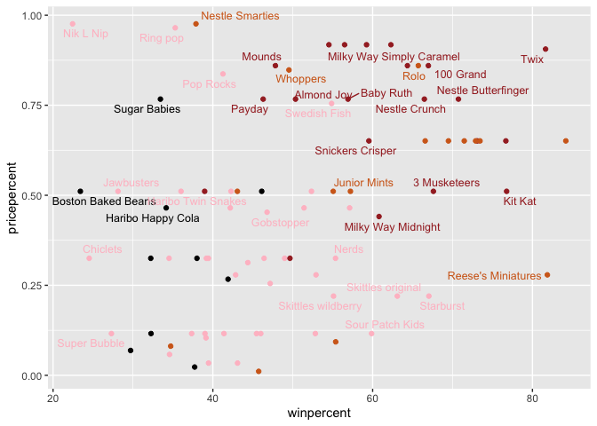

Halloween Candy Mini Project
================
Angela Liu

## Section 1: Importing candy data

Importing the data:

``` r
candy_file <- "candy-data.csv"

candy = read.csv(candy_file, row.names=1)
head(candy)
```

                 chocolate fruity caramel peanutyalmondy nougat crispedricewafer
    100 Grand            1      0       1              0      0                1
    3 Musketeers         1      0       0              0      1                0
    One dime             0      0       0              0      0                0
    One quarter          0      0       0              0      0                0
    Air Heads            0      1       0              0      0                0
    Almond Joy           1      0       0              1      0                0
                 hard bar pluribus sugarpercent pricepercent winpercent
    100 Grand       0   1        0        0.732        0.860   66.97173
    3 Musketeers    0   1        0        0.604        0.511   67.60294
    One dime        0   0        0        0.011        0.116   32.26109
    One quarter     0   0        0        0.011        0.511   46.11650
    Air Heads       0   0        0        0.906        0.511   52.34146
    Almond Joy      0   1        0        0.465        0.767   50.34755

> Q1. How many different candy types are in this dataset?

``` r
nrow(candy)
```

    [1] 85

There are 85 candy types in the data set.

> Q2. How many fruity candy types are in the dataset?

``` r
table(candy$fruity)
```


     0  1 
    47 38 

There are 38 fruity candy types.

## What is you favorite candy?

We will use `winpercent` variable to see the percentage of people who
prefer a selected candy over the a randomly chosen one.

``` r
candy["Twix", ]$winpercent
```

    [1] 81.64291

> Q3. What is your favorite candy in the dataset and what is it’s
> winpercent value?

``` r
candy["Milky Way", ]$winpercent
```

    [1] 73.09956

My favorite candies are Milky Ways and its winpercent value is 73.1%.

> Q4. What is the winpercent value for “Kit Kat”?

``` r
candy["Kit Kat", ]$winpercent
```

    [1] 76.7686

The winpercent value for Kit Kat is 76.8%.

> Q5. What is the winpercent value for “Tootsie Roll Snack Bars”?

``` r
candy["Tootsie Roll Snack Bars", ]$winpercent
```

    [1] 49.6535

The winpercent value is 49.7%.

Let’s use the `skimr()` function to see a quick overview of our dataset.

``` r
# install.packages("skimr")
library("skimr")
skim(candy)
```

|                                                  |       |
|:-------------------------------------------------|:------|
| Name                                             | candy |
| Number of rows                                   | 85    |
| Number of columns                                | 12    |
| \_\_\_\_\_\_\_\_\_\_\_\_\_\_\_\_\_\_\_\_\_\_\_   |       |
| Column type frequency:                           |       |
| numeric                                          | 12    |
| \_\_\_\_\_\_\_\_\_\_\_\_\_\_\_\_\_\_\_\_\_\_\_\_ |       |
| Group variables                                  | None  |

Data summary

**Variable type: numeric**

| skim_variable    | n_missing | complete_rate |  mean |    sd |    p0 |   p25 |   p50 |   p75 |  p100 | hist  |
|:-----------------|----------:|--------------:|------:|------:|------:|------:|------:|------:|------:|:------|
| chocolate        |         0 |             1 |  0.44 |  0.50 |  0.00 |  0.00 |  0.00 |  1.00 |  1.00 | ▇▁▁▁▆ |
| fruity           |         0 |             1 |  0.45 |  0.50 |  0.00 |  0.00 |  0.00 |  1.00 |  1.00 | ▇▁▁▁▆ |
| caramel          |         0 |             1 |  0.16 |  0.37 |  0.00 |  0.00 |  0.00 |  0.00 |  1.00 | ▇▁▁▁▂ |
| peanutyalmondy   |         0 |             1 |  0.16 |  0.37 |  0.00 |  0.00 |  0.00 |  0.00 |  1.00 | ▇▁▁▁▂ |
| nougat           |         0 |             1 |  0.08 |  0.28 |  0.00 |  0.00 |  0.00 |  0.00 |  1.00 | ▇▁▁▁▁ |
| crispedricewafer |         0 |             1 |  0.08 |  0.28 |  0.00 |  0.00 |  0.00 |  0.00 |  1.00 | ▇▁▁▁▁ |
| hard             |         0 |             1 |  0.18 |  0.38 |  0.00 |  0.00 |  0.00 |  0.00 |  1.00 | ▇▁▁▁▂ |
| bar              |         0 |             1 |  0.25 |  0.43 |  0.00 |  0.00 |  0.00 |  0.00 |  1.00 | ▇▁▁▁▂ |
| pluribus         |         0 |             1 |  0.52 |  0.50 |  0.00 |  0.00 |  1.00 |  1.00 |  1.00 | ▇▁▁▁▇ |
| sugarpercent     |         0 |             1 |  0.48 |  0.28 |  0.01 |  0.22 |  0.47 |  0.73 |  0.99 | ▇▇▇▇▆ |
| pricepercent     |         0 |             1 |  0.47 |  0.29 |  0.01 |  0.26 |  0.47 |  0.65 |  0.98 | ▇▇▇▇▆ |
| winpercent       |         0 |             1 | 50.32 | 14.71 | 22.45 | 39.14 | 47.83 | 59.86 | 84.18 | ▃▇▆▅▂ |

> Q6. Is there any variable/column that looks to be on a different scale
> to the majority of the other columns in the dataset?

The `winpercent` column is a different scale than the rest of the
columns since the others are mainly 0’s or 1’s to indicate true or
false.

> Q7. What do you think a zero and one represent for the
> candy\$chocolate column?

The zero represents no chocolate, while the one represents that there is
chocolate in the candy.

> Q8. Plot a histogram of winpercent values

``` r
hist(candy$winpercent)
```


> Q9. Is the distribution of winpercent values symmetrical?

No, the distribution is slightly skewed right.

> Q10. Is the center of the distribution above or below 50%?

The center of the distribution is below 50%.

> Q11. On average is chocolate candy higher or lower ranked than fruit
> candy?

``` r
# mean of chocolate candy rank
meanChocolate <- mean(candy$winpercent[as.logical(candy$chocolate)])
meanChocolate
```

    [1] 60.92153

``` r
# mean of fruit candy rank
meanFruity <- mean(candy$winpercent[as.logical(candy$fruity)])
meanFruity
```

    [1] 44.11974

``` r
# to see if chocolate candy is ranked higher than fruit candy
as.logical(meanChocolate > meanFruity)
```

    [1] TRUE

On average, chocolate candy is ranked higher than fruity candy.

> Q12. Is this difference statistically significant?

``` r
t.test(x = candy$chocolate, y = candy$fruity, c, alternative = "two.sided", mu = 0, paired = FALSE, var.equal = FALSE, conf.level = 0.95)
```


        Welch Two Sample t-test

    data:  candy$chocolate and candy$fruity
    t = -0.15357, df = 168, p-value = 0.8781
    alternative hypothesis: true difference in means is not equal to 0
    95 percent confidence interval:
     -0.1630081  0.1394786
    sample estimates:
    mean of x mean of y 
    0.4352941 0.4470588 

Since the true difference in means is not 0, the t.test reflects that
there is a statistical significant difference between the means of the
chocolate and fruity candy.

## Section 3: Overall Candy Rankings

> Q13. What are the five least liked candy types in this set?

Here we sort the dataset by order of `winpercent`

``` r
head(candy[order(candy$winpercent),], n=5)
```

                       chocolate fruity caramel peanutyalmondy nougat
    Nik L Nip                  0      1       0              0      0
    Boston Baked Beans         0      0       0              1      0
    Chiclets                   0      1       0              0      0
    Super Bubble               0      1       0              0      0
    Jawbusters                 0      1       0              0      0
                       crispedricewafer hard bar pluribus sugarpercent pricepercent
    Nik L Nip                         0    0   0        1        0.197        0.976
    Boston Baked Beans                0    0   0        1        0.313        0.511
    Chiclets                          0    0   0        1        0.046        0.325
    Super Bubble                      0    0   0        0        0.162        0.116
    Jawbusters                        0    1   0        1        0.093        0.511
                       winpercent
    Nik L Nip            22.44534
    Boston Baked Beans   23.41782
    Chiclets             24.52499
    Super Bubble         27.30386
    Jawbusters           28.12744

The five least liked candy types in the set are Nik L Nip, Boston Baked
Beans, Chiclets, Super Bubble, Jawbusters.

> Q14. What are the top 5 all time favorite candy types out of this set?

``` r
# order the list in decreasing order of winpercent
head(candy[order(candy$winpercent, decreasing = TRUE),], n=5)
```

                              chocolate fruity caramel peanutyalmondy nougat
    Reese's Peanut Butter cup         1      0       0              1      0
    Reese's Miniatures                1      0       0              1      0
    Twix                              1      0       1              0      0
    Kit Kat                           1      0       0              0      0
    Snickers                          1      0       1              1      1
                              crispedricewafer hard bar pluribus sugarpercent
    Reese's Peanut Butter cup                0    0   0        0        0.720
    Reese's Miniatures                       0    0   0        0        0.034
    Twix                                     1    0   1        0        0.546
    Kit Kat                                  1    0   1        0        0.313
    Snickers                                 0    0   1        0        0.546
                              pricepercent winpercent
    Reese's Peanut Butter cup        0.651   84.18029
    Reese's Miniatures               0.279   81.86626
    Twix                             0.906   81.64291
    Kit Kat                          0.511   76.76860
    Snickers                         0.651   76.67378

The top 5 all time favorite candy types are Reese’s Peanut Buttercups,
Reese’s miniatures, Twix, Kit Kat, and Snickers.

> Q15. Make a first barplot of candy ranking based on winpercent values.

``` r
library(ggplot2)

ggplot(candy) + 
  aes(winpercent, rownames(candy)) +
  geom_col()
```


> Q16. This is quite ugly, use the reorder() function to get the bars
> sorted by winpercent?

``` r
library(ggplot2)

ggplot(candy) + 
  aes(winpercent, reorder(rownames(candy), winpercent)) +
  geom_col()
```


Now let’s add some color:

``` r
my_cols=rep("black", nrow(candy))
my_cols[as.logical(candy$chocolate)] = "chocolate"
my_cols[as.logical(candy$bar)] = "brown"
my_cols[as.logical(candy$fruity)] = "pink"
```

``` r
ggplot(candy) + 
  aes(winpercent, reorder(rownames(candy),winpercent)) +
  geom_col(fill=my_cols) 
```


Now, for the first time, using this plot we can answer questions like:
\> Q17. What is the worst ranked chocolate candy?

The worst ranked chocolate candy (chocolate colored in the chart) is
Sixlets.

> Q18. What is the best ranked fruity candy?

The best ranked fruity candy (colored pink) are Starbursts.

## Section 4: Taking a look at pricepercent

Let’s plot `winpercent` vs `pricepercent`. The `pricepercent` variable
shows the percentile rank of the candy’s price in comparison to other
candies.

``` r
library(ggrepel)

# How about a plot of price vs win
ggplot(candy) +
  aes(winpercent, pricepercent, label=rownames(candy)) +
  geom_point(col=my_cols) + 
  geom_text_repel(col=my_cols, size=3.3, max.overlaps = 5)
```

    Warning: ggrepel: 50 unlabeled data points (too many overlaps). Consider
    increasing max.overlaps



> Q19. Which candy type is the highest ranked in terms of winpercent for
> the least money - i.e. offers the most bang for your buck?

The fruity candy (marked in pink) are ranked highest in winpercent for
less money (lower pricepercent).

> Q20. What are the top 5 most expensive candy types in the dataset and
> of these which is the least popular?

``` r
ord <- order(candy$pricepercent, decreasing = TRUE) 
head( candy[ord,c(11,12)], n=5 )
```

                             pricepercent winpercent
    Nik L Nip                       0.976   22.44534
    Nestle Smarties                 0.976   37.88719
    Ring pop                        0.965   35.29076
    Hershey's Krackel               0.918   62.28448
    Hershey's Milk Chocolate        0.918   56.49050

The top 5 most expensive candies by highest pricepercent are Nik L Nip,
Nestle Smarties, Ring pop, Hershey’s Krackel, Hershey’s Milk Cocolate.
The least popular (by winpercent) is Nik L Nip.

## Section 5: Exploring the Correlation Structure

We can plot correlation matrices with `corrplot` package.

``` r
library(corrplot)
```

    corrplot 0.92 loaded

``` r
cij <- cor(candy)
corrplot(cij)
```


> Q22. Examining this plot what two variables are anti-correlated
> (i.e. have minus values)?

Fruity and chocolate candies are anti-correlated as they have very red
dots (negative values).

> Q23. Similarly, what two variables are most positively correlated?

It seems that winpercent and chocolate along with chocolate and bar are
positively correlated.

## Section 6: PCA

We can apply PCA to our dataset through `prcomp()`.

``` r
pca <- prcomp(candy, scale = TRUE)
summary(pca)
```

    Importance of components:
                              PC1    PC2    PC3     PC4    PC5     PC6     PC7
    Standard deviation     2.0788 1.1378 1.1092 1.07533 0.9518 0.81923 0.81530
    Proportion of Variance 0.3601 0.1079 0.1025 0.09636 0.0755 0.05593 0.05539
    Cumulative Proportion  0.3601 0.4680 0.5705 0.66688 0.7424 0.79830 0.85369
                               PC8     PC9    PC10    PC11    PC12
    Standard deviation     0.74530 0.67824 0.62349 0.43974 0.39760
    Proportion of Variance 0.04629 0.03833 0.03239 0.01611 0.01317
    Cumulative Proportion  0.89998 0.93832 0.97071 0.98683 1.00000

Now we plot a PCA score plot of PC1 vs PC2.

``` r
plot(pca$x[,1:2])
```


Adding some color and character:

``` r
plot(pca$x[,1:2], col=my_cols, pch=16)
```


In order to use ggplot2, we need to have an input data.frame with a
separate column for the different aesthetics in the final plot. We will
make a new data.frame that includes both the PCA results and candy data.

``` r
# Make a new data-frame with our PCA results and candy data
my_data <- cbind(candy, pca$x[,1:3])
```

``` r
p <- ggplot(my_data) + 
        aes(x=PC1, y=PC2, 
            size=winpercent/100,  
            text=rownames(my_data),
            label=rownames(my_data)) +
        geom_point(col=my_cols)
p
```


The `ggrepel` package can label the plot with candy names that do not
overlap.

``` r
library(ggrepel)

p + geom_text_repel(size=3.3, col=my_cols, max.overlaps = 15)  + 
  theme(legend.position = "none") +
  labs(title="Halloween Candy PCA Space",
       subtitle="Colored by type: chocolate bar (dark brown), chocolate other (light brown), fruity (red), other (black)",
       caption="Data from 538")
```

    Warning: ggrepel: 15 unlabeled data points (too many overlaps). Consider
    increasing max.overlaps


To make a more interactive plot where you can hover and see labels,
`plotly` is quite useful.

``` r
# install.packages("plotly")
# library(plotly)
```

``` r
# ggplotly(p)
```

Now when we hover a mouse over a point, we can see the label name, PC1,
PC2, and winpercent.

``` r
par(mar=c(8,4,2,2))
barplot(pca$rotation[,1], las=2, ylab="PC1 Contribution")
```


> Q24. What original variables are picked up strongly by PC1 in the
> positive direction? Do these make sense to you?

The variables fruity, hard, and pluribus are picked up strongly by PC1
in the positive direction. This makes sense as there is more variance in
the fruity, hard, and pluribus variables. A pluribus would have more
variance since there are different types of candies included, leading to
more variance.
