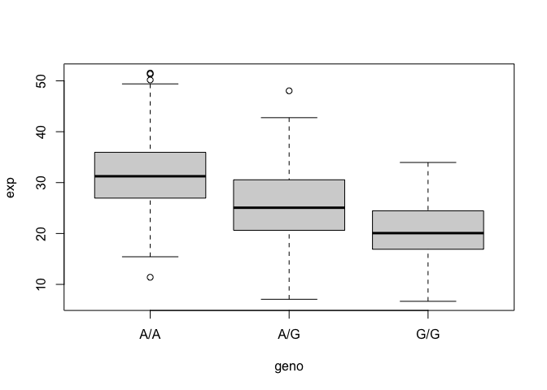
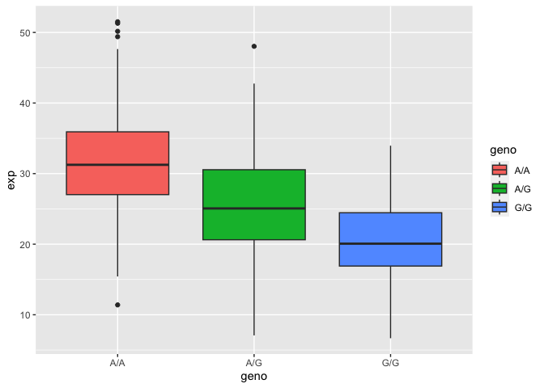

Population Scale Analysis
================
Angela Liu

We will be taking a look at genetic differences at a population level
and see if there’s an association between the asthma related SNPs on
ORMDL3.

> Q13: Read this file into R and determine the sample size for each
> genotype and their corresponding median expression levels for each of
> these genotypes.

Let’s see how many samples we have:

``` r
expr <- read.table("rs8067378_ENSG00000172057.6.txt")
head(expr)
```

       sample geno      exp
    1 HG00367  A/G 28.96038
    2 NA20768  A/G 20.24449
    3 HG00361  A/A 31.32628
    4 HG00135  A/A 34.11169
    5 NA18870  G/G 18.25141
    6 NA11993  A/A 32.89721

``` r
nrow(expr)
```

    [1] 462

``` r
table(expr$geno)
```


    A/A A/G G/G 
    108 233 121 

``` r
summary(expr)
```

        sample              geno                exp        
     Length:462         Length:462         Min.   : 6.675  
     Class :character   Class :character   1st Qu.:20.004  
     Mode  :character   Mode  :character   Median :25.116  
                                           Mean   :25.640  
                                           3rd Qu.:30.779  
                                           Max.   :51.518  

``` r
# save the boxplot information into variable medExp
medExp <- boxplot(exp~geno, data = expr)
```



``` r
medExp$stats
```

             [,1]     [,2]     [,3]
    [1,] 15.42908  7.07505  6.67482
    [2,] 26.95022 20.62572 16.90256
    [3,] 31.24847 25.06486 20.07363
    [4,] 35.95503 30.55183 24.45672
    [5,] 49.39612 42.75662 33.95602

``` r
medExp$stats[3,]
```

    [1] 31.24847 25.06486 20.07363

The sample size for A/A genotype is 108. A/G has 233 samples and G/G has
121 samples.

The third row of the stats of the boxplot reflect the median of each
genotype. The medians go as followed: 31.25 for A/A, 25.06 for A/G,
20.07 for G/G.

> Q14: Generate a boxplot with a box per genotype, what could you infer
> from the relative expression value between A/A and G/G displayed in
> this plot? Does the SNP effect the expression of ORMDL3?

``` r
library(ggplot2)
```

Let’s make a boxplot of our data:

``` r
# notch adds a belt
ggplot(expr) + aes(x=geno, y=exp, fill = geno) +
  geom_boxplot(noth=TRUE)
```

    Warning in geom_boxplot(noth = TRUE): Ignoring unknown parameters: `noth`



From the plot, we can see that A/A has a higher expression value than
G/G. Yes, the SNP affects the expression of ORMDL3 as the genotype for
G/G is reduced with its lower median.
