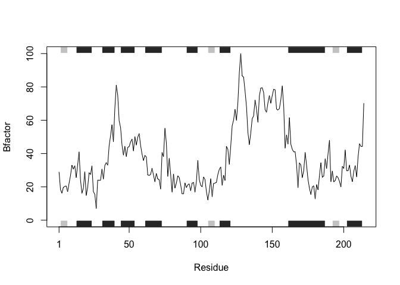

HW 6, Functions
================
Angela Liu

## Section 1

> A. Improve this regular R code by abstracting the main activities in
> your own new function. Note, we will go through this example together
> in the formal lecture. The main steps should entail running through
> the code to see if it works, simplifying to a core working code
> snippet, reducing any calculation duplication, and finally
> transferring your new streamlined code into a more useful function for
> you.

``` r
# (A. Can you improve this analysis code?
df <- data.frame(a=1:10, b=seq(200,400,length=10),c=11:20,d=NA)
df$a <- (df$a - min(df$a)) / (max(df$a) - min(df$a))
df$b <- (df$b - min(df$a)) / (max(df$b) - min(df$b))
df$c <- (df$c - min(df$c)) / (max(df$c) - min(df$c))
df$d <- (df$d - min(df$d)) / (max(df$a) - min(df$d))
df
```

               a        b         c  d
    1  0.0000000 1.000000 0.0000000 NA
    2  0.1111111 1.111111 0.1111111 NA
    3  0.2222222 1.222222 0.2222222 NA
    4  0.3333333 1.333333 0.3333333 NA
    5  0.4444444 1.444444 0.4444444 NA
    6  0.5555556 1.555556 0.5555556 NA
    7  0.6666667 1.666667 0.6666667 NA
    8  0.7777778 1.777778 0.7777778 NA
    9  0.8888889 1.888889 0.8888889 NA
    10 1.0000000 2.000000 1.0000000 NA

Let’s see the outputs of these calculations with df.

``` r
df
```

               a        b         c  d
    1  0.0000000 1.000000 0.0000000 NA
    2  0.1111111 1.111111 0.1111111 NA
    3  0.2222222 1.222222 0.2222222 NA
    4  0.3333333 1.333333 0.3333333 NA
    5  0.4444444 1.444444 0.4444444 NA
    6  0.5555556 1.555556 0.5555556 NA
    7  0.6666667 1.666667 0.6666667 NA
    8  0.7777778 1.777778 0.7777778 NA
    9  0.8888889 1.888889 0.8888889 NA
    10 1.0000000 2.000000 1.0000000 NA

This function subtracts each column element from the minimum value in
the table and divides it by the range of the column (max-min).

``` r
analysis <- function(x) {
  #subtracting the input element from the column min and dividing it by the column range
  x - min(x) / (max(x) - min(x))
}
analysis(df$b)
```

     [1] 0.0000000 0.1111111 0.2222222 0.3333333 0.4444444 0.5555556 0.6666667
     [8] 0.7777778 0.8888889 1.0000000

Let’s check using the `apply` function:

``` r
results <- apply(df, 2, analysis)
results
```

                  a         b         c  d
     [1,] 0.0000000 0.0000000 0.0000000 NA
     [2,] 0.1111111 0.1111111 0.1111111 NA
     [3,] 0.2222222 0.2222222 0.2222222 NA
     [4,] 0.3333333 0.3333333 0.3333333 NA
     [5,] 0.4444444 0.4444444 0.4444444 NA
     [6,] 0.5555556 0.5555556 0.5555556 NA
     [7,] 0.6666667 0.6666667 0.6666667 NA
     [8,] 0.7777778 0.7777778 0.7777778 NA
     [9,] 0.8888889 0.8888889 0.8888889 NA
    [10,] 1.0000000 1.0000000 1.0000000 NA

## Part B

``` r
#install.packages("bio3d")
```

``` r
# Can you improve this analysis code?
library(bio3d)
s1 <- read.pdb("4AKE") # kinase with drug
```

      Note: Accessing on-line PDB file

``` r
s2 <- read.pdb("1AKE") # kinase no drug
```

      Note: Accessing on-line PDB file
       PDB has ALT records, taking A only, rm.alt=TRUE

``` r
s3 <- read.pdb("1E4Y") # kinase with drug
```

      Note: Accessing on-line PDB file

``` r
s1.chainA <- trim.pdb(s1, chain="A", elety="CA")
s2.chainA <- trim.pdb(s2, chain="A", elety="CA")
s3.chainA <- trim.pdb(s1, chain="A", elety="CA")

s1.b <- s1.chainA$atom$b
s2.b <- s2.chainA$atom$b
s3.b <- s3.chainA$atom$b

plotb3(s1.b, sse=s1.chainA, typ="l", ylab="Bfactor")
```


``` r
plotb3(s2.b, sse=s2.chainA, typ="l", ylab="Bfactor")
```


``` r
plotb3(s3.b, sse=s3.chainA, typ="l", ylab="Bfactor")
```


> Q1. What type of object is returned from the read.pdb() function?

The `read.pdb()` returns a PDB file.

``` r
s1 <- read.pdb("4AKE") # kinase with drug
```

      Note: Accessing on-line PDB file

    Warning in get.pdb(file, path = tempdir(), verbose =
    FALSE): /var/folders/rg/hzhcp6md0k153d9cg8cm4p0m0000gn/T//RtmpQw2acT/4AKE.pdb
    exists. Skipping download

``` r
s1
```


     Call:  read.pdb(file = "4AKE")

       Total Models#: 1
         Total Atoms#: 3459,  XYZs#: 10377  Chains#: 2  (values: A B)

         Protein Atoms#: 3312  (residues/Calpha atoms#: 428)
         Nucleic acid Atoms#: 0  (residues/phosphate atoms#: 0)

         Non-protein/nucleic Atoms#: 147  (residues: 147)
         Non-protein/nucleic resid values: [ HOH (147) ]

       Protein sequence:
          MRIILLGAPGAGKGTQAQFIMEKYGIPQISTGDMLRAAVKSGSELGKQAKDIMDAGKLVT
          DELVIALVKERIAQEDCRNGFLLDGFPRTIPQADAMKEAGINVDYVLEFDVPDELIVDRI
          VGRRVHAPSGRVYHVKFNPPKVEGKDDVTGEELTTRKDDQEETVRKRLVEYHQMTAPLIG
          YYSKEAEAGNTKYAKVDGTKPVAEVRADLEKILGMRIILLGAPGA...<cut>...KILG

    + attr: atom, xyz, seqres, helix, sheet,
            calpha, remark, call

> Q2. What does the trim.pdb() function do?

The `trim.pdb()` function narrows down the information from the PDB by
looking at more specific chains and decreases the amount of residues
being looked at.

``` r
s1.chainA <- trim.pdb(s1, chain="A", elety="CA")
s1.chainA
```


     Call:  trim.pdb(pdb = s1, chain = "A", elety = "CA")

       Total Models#: 1
         Total Atoms#: 214,  XYZs#: 642  Chains#: 1  (values: A)

         Protein Atoms#: 214  (residues/Calpha atoms#: 214)
         Nucleic acid Atoms#: 0  (residues/phosphate atoms#: 0)

         Non-protein/nucleic Atoms#: 0  (residues: 0)
         Non-protein/nucleic resid values: [ none ]

       Protein sequence:
          MRIILLGAPGAGKGTQAQFIMEKYGIPQISTGDMLRAAVKSGSELGKQAKDIMDAGKLVT
          DELVIALVKERIAQEDCRNGFLLDGFPRTIPQADAMKEAGINVDYVLEFDVPDELIVDRI
          VGRRVHAPSGRVYHVKFNPPKVEGKDDVTGEELTTRKDDQEETVRKRLVEYHQMTAPLIG
          YYSKEAEAGNTKYAKVDGTKPVAEVRADLEKILG

    + attr: atom, helix, sheet, seqres, xyz,
            calpha, call

> Q3. What input parameter would turn off the marginal black and grey
> rectangles in the plots and what do they represent in this case?

Deleting the `sse` parameter would turn off the marginal rectangles. The
`sse` parameter represents the secondary structure element.

``` r
plotb3(s1.b, sse=s1.chainA, typ="l", ylab="Bfactor")
```


``` r
#the same line of code, without sse
plotb3(s1.b, typ="l", ylab="Bfactor")
```


> Q4. What would be a better plot to compare across the different
> proteins?

The plot with the `sse` element would be a better plot to compare across
different proteins as it contains more information to compare.

``` r
plotb3(s1.b, sse=s1.chainA, typ="l", ylab="Bfactor")
```


``` r
plotb3(s2.b, sse=s2.chainA, typ="l", ylab="Bfactor")
```


``` r
plotb3(s1.b, sse=s1.chainA, typ="l", ylab="Bfactor")
```



``` r
plotb3(s2.b, sse=s2.chainA, typ="l", ylab="Bfactor")
```


> Q5. Which proteins are more similar to each other in their B-factor
> trends? How could you quantify this? HINT: try the rbind(), dist() and
> hclust() functions together with a resulting dendrogram plot. Look up
> the documentation to see what each of these functions does.

s1.b and s3.b are more similar as they are closer together on the plot.

``` r
hc <- hclust( dist( rbind(s1.b, s2.b, s3.b) ) )
plot(hc)
```


## Homework \#6

> Q6. How would you generalize the original code above to work with any
> set of input protein structures?

original code:

``` r
#install.packages("bio3d")
```

``` r
# Can you improve this analysis code?
library(bio3d)
s1 <- read.pdb("4AKE") # kinase with drug
```

      Note: Accessing on-line PDB file

    Warning in get.pdb(file, path = tempdir(), verbose =
    FALSE): /var/folders/rg/hzhcp6md0k153d9cg8cm4p0m0000gn/T//RtmpQw2acT/4AKE.pdb
    exists. Skipping download

``` r
s2 <- read.pdb("1AKE") # kinase no drug
```

      Note: Accessing on-line PDB file

    Warning in get.pdb(file, path = tempdir(), verbose =
    FALSE): /var/folders/rg/hzhcp6md0k153d9cg8cm4p0m0000gn/T//RtmpQw2acT/1AKE.pdb
    exists. Skipping download

       PDB has ALT records, taking A only, rm.alt=TRUE

``` r
s3 <- read.pdb("1E4Y") # kinase with drug
```

      Note: Accessing on-line PDB file

    Warning in get.pdb(file, path = tempdir(), verbose =
    FALSE): /var/folders/rg/hzhcp6md0k153d9cg8cm4p0m0000gn/T//RtmpQw2acT/1E4Y.pdb
    exists. Skipping download

``` r
s1.chainA <- trim.pdb(s1, chain="A", elety="CA")
s2.chainA <- trim.pdb(s2, chain="A", elety="CA")
s3.chainA <- trim.pdb(s1, chain="A", elety="CA")

s1.b <- s1.chainA$atom$b
s2.b <- s2.chainA$atom$b
s3.b <- s3.chainA$atom$b

plotb3(s1.b, sse=s1.chainA, typ="l", ylab="Bfactor")
```


``` r
plotb3(s2.b, sse=s2.chainA, typ="l", ylab="Bfactor")
```


``` r
plotb3(s3.b, sse=s3.chainA, typ="l", ylab="Bfactor")
```


Let’s see what s1 outputs. It seems to be a pdb file.

``` r
s1
```


     Call:  read.pdb(file = "4AKE")

       Total Models#: 1
         Total Atoms#: 3459,  XYZs#: 10377  Chains#: 2  (values: A B)

         Protein Atoms#: 3312  (residues/Calpha atoms#: 428)
         Nucleic acid Atoms#: 0  (residues/phosphate atoms#: 0)

         Non-protein/nucleic Atoms#: 147  (residues: 147)
         Non-protein/nucleic resid values: [ HOH (147) ]

       Protein sequence:
          MRIILLGAPGAGKGTQAQFIMEKYGIPQISTGDMLRAAVKSGSELGKQAKDIMDAGKLVT
          DELVIALVKERIAQEDCRNGFLLDGFPRTIPQADAMKEAGINVDYVLEFDVPDELIVDRI
          VGRRVHAPSGRVYHVKFNPPKVEGKDDVTGEELTTRKDDQEETVRKRLVEYHQMTAPLIG
          YYSKEAEAGNTKYAKVDGTKPVAEVRADLEKILGMRIILLGAPGA...<cut>...KILG

    + attr: atom, xyz, seqres, helix, sheet,
            calpha, remark, call

To make a function that returns the pdb file:

``` r
#to output the pdb file for protein of interest
pdbFile <- function(x) {
  #let x be the protein (or in this example, kinase) of interest
  read.pdb(x)
}

#to check
pdbFile("4AKE")
```

      Note: Accessing on-line PDB file

    Warning in get.pdb(file, path = tempdir(), verbose =
    FALSE): /var/folders/rg/hzhcp6md0k153d9cg8cm4p0m0000gn/T//RtmpQw2acT/4AKE.pdb
    exists. Skipping download


     Call:  read.pdb(file = x)

       Total Models#: 1
         Total Atoms#: 3459,  XYZs#: 10377  Chains#: 2  (values: A B)

         Protein Atoms#: 3312  (residues/Calpha atoms#: 428)
         Nucleic acid Atoms#: 0  (residues/phosphate atoms#: 0)

         Non-protein/nucleic Atoms#: 147  (residues: 147)
         Non-protein/nucleic resid values: [ HOH (147) ]

       Protein sequence:
          MRIILLGAPGAGKGTQAQFIMEKYGIPQISTGDMLRAAVKSGSELGKQAKDIMDAGKLVT
          DELVIALVKERIAQEDCRNGFLLDGFPRTIPQADAMKEAGINVDYVLEFDVPDELIVDRI
          VGRRVHAPSGRVYHVKFNPPKVEGKDDVTGEELTTRKDDQEETVRKRLVEYHQMTAPLIG
          YYSKEAEAGNTKYAKVDGTKPVAEVRADLEKILGMRIILLGAPGA...<cut>...KILG

    + attr: atom, xyz, seqres, helix, sheet,
            calpha, remark, call

Onto the next part of making a function for `trim.pdb`

``` r
s1.chainA
```


     Call:  trim.pdb(pdb = s1, chain = "A", elety = "CA")

       Total Models#: 1
         Total Atoms#: 214,  XYZs#: 642  Chains#: 1  (values: A)

         Protein Atoms#: 214  (residues/Calpha atoms#: 214)
         Nucleic acid Atoms#: 0  (residues/phosphate atoms#: 0)

         Non-protein/nucleic Atoms#: 0  (residues: 0)
         Non-protein/nucleic resid values: [ none ]

       Protein sequence:
          MRIILLGAPGAGKGTQAQFIMEKYGIPQISTGDMLRAAVKSGSELGKQAKDIMDAGKLVT
          DELVIALVKERIAQEDCRNGFLLDGFPRTIPQADAMKEAGINVDYVLEFDVPDELIVDRI
          VGRRVHAPSGRVYHVKFNPPKVEGKDDVTGEELTTRKDDQEETVRKRLVEYHQMTAPLIG
          YYSKEAEAGNTKYAKVDGTKPVAEVRADLEKILG

    + attr: atom, helix, sheet, seqres, xyz,
            calpha, call

This code outputs a pdb file using narrowed down residues and/or
structures.

``` r
#function to output pdb using trimmed residues
pdbTrim <- function(x, y, z) {
  #let 'x' be the protein of interest, 'y' be the chain, 'z' be the elety
  trim.pdb(x, chain = y, elety = z)
}

#To test if the function works
pdbTrim(s1, "A", "CA")
```


     Call:  trim.pdb(pdb = x, chain = y, elety = z)

       Total Models#: 1
         Total Atoms#: 214,  XYZs#: 642  Chains#: 1  (values: A)

         Protein Atoms#: 214  (residues/Calpha atoms#: 214)
         Nucleic acid Atoms#: 0  (residues/phosphate atoms#: 0)

         Non-protein/nucleic Atoms#: 0  (residues: 0)
         Non-protein/nucleic resid values: [ none ]

       Protein sequence:
          MRIILLGAPGAGKGTQAQFIMEKYGIPQISTGDMLRAAVKSGSELGKQAKDIMDAGKLVT
          DELVIALVKERIAQEDCRNGFLLDGFPRTIPQADAMKEAGINVDYVLEFDVPDELIVDRI
          VGRRVHAPSGRVYHVKFNPPKVEGKDDVTGEELTTRKDDQEETVRKRLVEYHQMTAPLIG
          YYSKEAEAGNTKYAKVDGTKPVAEVRADLEKILG

    + attr: atom, helix, sheet, seqres, xyz,
            calpha, call

``` r
pdbTrim(s2, "A", "CA")
```


     Call:  trim.pdb(pdb = x, chain = y, elety = z)

       Total Models#: 1
         Total Atoms#: 214,  XYZs#: 642  Chains#: 1  (values: A)

         Protein Atoms#: 214  (residues/Calpha atoms#: 214)
         Nucleic acid Atoms#: 0  (residues/phosphate atoms#: 0)

         Non-protein/nucleic Atoms#: 0  (residues: 0)
         Non-protein/nucleic resid values: [ none ]

       Protein sequence:
          MRIILLGAPGAGKGTQAQFIMEKYGIPQISTGDMLRAAVKSGSELGKQAKDIMDAGKLVT
          DELVIALVKERIAQEDCRNGFLLDGFPRTIPQADAMKEAGINVDYVLEFDVPDELIVDRI
          VGRRVHAPSGRVYHVKFNPPKVEGKDDVTGEELTTRKDDQEETVRKRLVEYHQMTAPLIG
          YYSKEAEAGNTKYAKVDGTKPVAEVRADLEKILG

    + attr: atom, helix, sheet, seqres, xyz,
            calpha, call

As for `s1.b`, `s2.b` and `s3.b`, let’s make other function.

``` r
#to see the output
s1.b
```

      [1]  29.02  18.44  16.20  19.67  20.26  20.55  17.05  22.13  26.71  33.05
     [11]  30.66  32.73  25.61  33.19  41.03  24.09  16.18  19.14  29.19  14.79
     [21]  19.63  28.54  27.49  32.56  17.13  15.50   6.98  24.07  24.00  23.94
     [31]  30.70  24.70  32.84  34.60  33.01  44.60  50.74  57.32  47.04  67.13
     [41]  81.04  75.20  59.68  55.63  45.12  39.04  44.31  38.21  43.70  44.19
     [51]  47.00  48.67  41.54  50.22  45.07  49.77  52.04  44.82  39.75  35.79
     [61]  38.92  37.93  27.18  26.86  27.53  31.16  27.08  23.03  28.12  24.78
     [71]  24.22  18.69  40.67  38.08  55.26  46.29  26.25  37.14  27.50  16.86
     [81]  27.76  19.27  22.22  26.70  25.52  21.22  15.90  15.84  22.44  19.61
     [91]  21.23  21.79  17.64  22.19  22.73  16.80  23.25  35.95  24.42  20.96
    [101]  20.00  25.99  24.39  17.19  12.16  17.35  24.97  14.08  22.01  22.26
    [111]  22.78  27.47  30.49  32.02  20.90  27.03  23.84  44.37  42.47  33.48
    [121]  44.56  56.67  60.18  66.62  59.95  70.81  88.63 100.11  86.60  85.80
    [131]  77.48  68.13  52.66  45.34  52.43  60.90  62.64  72.19  66.75  58.73
    [141]  74.57  79.29  79.53  76.58  66.40  64.76  70.48  74.84  70.11  74.82
    [151]  78.61  78.24  66.70  66.10  67.01  72.28  80.64  68.54  43.23  51.24
    [161]  45.72  61.60  45.61  42.57  41.03  41.02  33.34  19.48  34.38  33.11
    [171]  25.48  29.68  40.71  32.91  24.41  19.20  15.43  19.93  20.66  12.72
    [181]  21.40  18.21  26.68  34.50  25.77  26.52  36.85  31.05  39.84  48.03
    [191]  23.04  29.57  23.00  23.80  26.59  25.49  23.25  19.89  32.37  30.97
    [201]  42.16  29.64  29.69  33.15  26.38  23.17  29.35  32.80  25.92  38.01
    [211]  45.95  44.26  44.35  70.26

``` r
#function to provide the atomic information
atomResult <- function(x) {
  #let x be the protein chain of interest
  x$atom$b
}

atomResult(s1.chainA)
```

      [1]  29.02  18.44  16.20  19.67  20.26  20.55  17.05  22.13  26.71  33.05
     [11]  30.66  32.73  25.61  33.19  41.03  24.09  16.18  19.14  29.19  14.79
     [21]  19.63  28.54  27.49  32.56  17.13  15.50   6.98  24.07  24.00  23.94
     [31]  30.70  24.70  32.84  34.60  33.01  44.60  50.74  57.32  47.04  67.13
     [41]  81.04  75.20  59.68  55.63  45.12  39.04  44.31  38.21  43.70  44.19
     [51]  47.00  48.67  41.54  50.22  45.07  49.77  52.04  44.82  39.75  35.79
     [61]  38.92  37.93  27.18  26.86  27.53  31.16  27.08  23.03  28.12  24.78
     [71]  24.22  18.69  40.67  38.08  55.26  46.29  26.25  37.14  27.50  16.86
     [81]  27.76  19.27  22.22  26.70  25.52  21.22  15.90  15.84  22.44  19.61
     [91]  21.23  21.79  17.64  22.19  22.73  16.80  23.25  35.95  24.42  20.96
    [101]  20.00  25.99  24.39  17.19  12.16  17.35  24.97  14.08  22.01  22.26
    [111]  22.78  27.47  30.49  32.02  20.90  27.03  23.84  44.37  42.47  33.48
    [121]  44.56  56.67  60.18  66.62  59.95  70.81  88.63 100.11  86.60  85.80
    [131]  77.48  68.13  52.66  45.34  52.43  60.90  62.64  72.19  66.75  58.73
    [141]  74.57  79.29  79.53  76.58  66.40  64.76  70.48  74.84  70.11  74.82
    [151]  78.61  78.24  66.70  66.10  67.01  72.28  80.64  68.54  43.23  51.24
    [161]  45.72  61.60  45.61  42.57  41.03  41.02  33.34  19.48  34.38  33.11
    [171]  25.48  29.68  40.71  32.91  24.41  19.20  15.43  19.93  20.66  12.72
    [181]  21.40  18.21  26.68  34.50  25.77  26.52  36.85  31.05  39.84  48.03
    [191]  23.04  29.57  23.00  23.80  26.59  25.49  23.25  19.89  32.37  30.97
    [201]  42.16  29.64  29.69  33.15  26.38  23.17  29.35  32.80  25.92  38.01
    [211]  45.95  44.26  44.35  70.26

This function `atomResult` prints out the atomic information from the
pdb file.

Now for last part:

``` r
plotb3(s1.b, sse=s1.chainA, typ="l", ylab="Bfactor") 
```


This function below will return a plot of the proteins’ Bfactors and
their secondary structural elements in a graph.

``` r
bFactPlot <- function(x, y){
  #x is the protein of interest, y is the secondary structural element
  plotb3(x, sse = y, typ = "l", ylab = "Bfactor")
}

bFactPlot(s1.b, s1.chainA)
```


